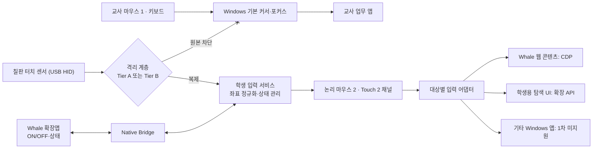
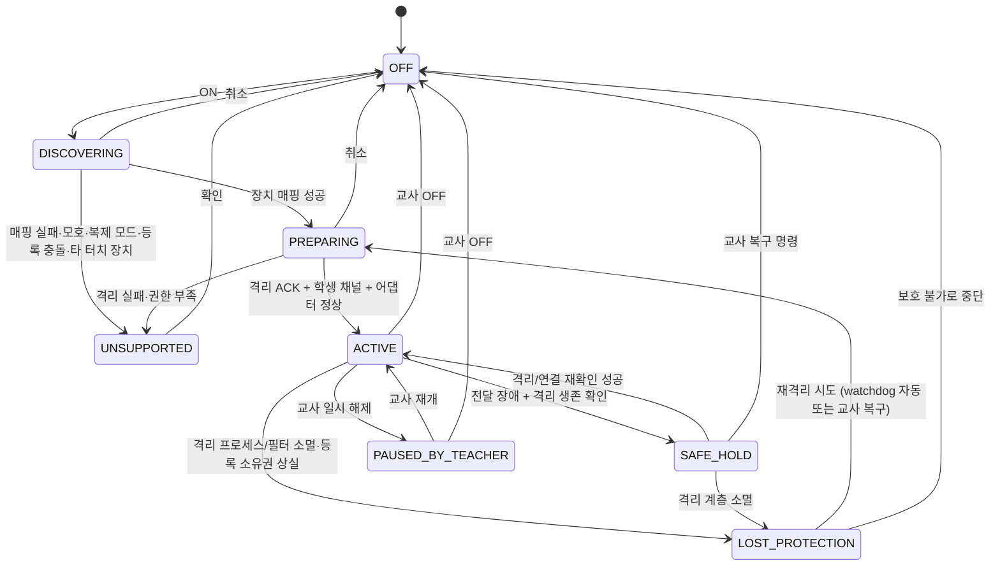

# Whale Dual Input — 모니터 2 독립 입력 시스템 개발 설계서 v7.3

> 작성일: 2026-10-08  
> 기반: 사용자 제공 `ARCHITECTURE_V7_2_MONITOR2.md`를 점검·보완한 v7.3 (v7.2 = v7.1 유지·보완본)  
> 프로젝트: `LUCKYBRIDGE/naver` / NAVER Whale·WhaleSpace 교육용 확장 프로그램  
> 상태: **구현 지침 및 기술 의사결정 문서** — 구현·실기기 성공을 의미하지 않음  
> 기준 환경: 교사 Windows PC **한 대**, 모니터 1(교사용), 모니터 2(Windows PC에 연결된 전자칠판), **화면 확장** 모드  
> 지식재산 원칙: 외부 상용 다중 마우스 제품의 실행 엔진·드라이버·SDK·비공개 코드에 의존하지 않는 자체 설계. 공개 자료는 출처·라이선스를 구분해 아키텍처 수준에서만 참고한다.
> 변경 범위: **개발 설계 문서**. `LUCKYBRIDGE/naver` 실행 코드·GitHub 저장소는 이 파일 작성만으로 수정되지 않는다.
> 검증 기준일: 2026-10-08 — [확인] 항목의 출처·확인일은 **부록 C 근거 검증 대장**에 모았다.

**근거 표기 규칙** — 이 문서의 기술 판단에는 근거 수준을 붙인다.

| 표기 | 뜻 |
|---|---|
| **[확인]** | Microsoft·Chromium 공식 문서 또는 인용한 공개 저장소의 **명시적 내용**으로 확인한 사실. **설치 환경에서 작동한다는 뜻은 아님** |
| **[설계]** | 본 프로젝트가 선택한 구현 정책·계약·목표. 실제 지원 여부는 후속 실증과 별도 |
| **[가설]** | 이론·API를 근거로 제안했으나 재현·측정을 마치지 않은 경로 |
| **[미확인]** | 구현·정책·라이선스·하드웨어 동작 등 현재 확인하지 못한 사항 |

[확인]은 "공식 문서에 그렇게 적혀 있다"는 뜻이며 우리 칠판·교사 PC에서 된다는 뜻이 아니다. 대장(부록 C)에 없는 [확인]은 쓰지 않는다.

---

## 변경 요약 (v7.0 → v7.1)

| # | v7.1 변경 | 이유 |
|---|---|---|
| 1 | **목표점 재정의** — "학생 터치와 교사 실마우스의 분리"를 합격/불합격 기준(G1)과 품질 기준(G2)으로 구분 | 우선순위가 흐려지면 부가 기능에 시간이 먼저 쓰임 |
| 2 | **M0.5 실측 단계 추가** — 칠판이 Windows에 어떻게 보이는지, 현재 납치 증상을 수치로 재현 | 경로 선택에 필요한 데이터가 없었음 |
| 3 | **Tier A(드라이버 없는 경로) 추가** — UI Access 포인터 리디렉션 | v7.0은 커널 드라이버로 곧바로 진행 |
| 4 | **드라이버(Tier B)는 결정 게이트 뒤로** | 서명·HVCI·학교 관리자 권한 장벽 |
| 5 | **상태 정책 보완** — 부팅 기본값, 하트비트, 눌림 상태 정리, 교사 일시 해제 | 장애·교실 운용 시나리오 공백 |
| 6 | **M2를 M2a(삼키기만) / M2b(전달)로 분할** | 핵심 목표(G1)를 가장 먼저 증명 |
| 7 | **웨일 어댑터 보완** — 포커스 에뮬레이션, 창 가림 | 학생 창이 Windows 전경이 아닐 때의 동작 |
| 8 | **판정 로거 신설, 시험 항목 추가** | "교사 커서 0건"의 증거 확보 |
| 9 | 문서 정리 — 다이어그램 재작성, 용어집, §0.2·§12 중복 통합 | 가독성 |

---

## 변경 요약 (v7.1 → v7.2)

| # | 보완 | 근거와 목적 |
|---|---|---|
| 1 | MouseMux 공개 **MIT V2 WinSDK 예제**와 **별도 Chromium 패치 저장소**를 구분 | 참고 자료의 기술 범위·저작권 적용 범위를 혼동하지 않기 |
| 2 | 입력 계층을 **Capture / Isolation / Logical Seat / Target Adapter**의 계약으로 분리 | 이미 분리된 입력을 수신하는 API와 **원래 Windows 입력의 차단**을 혼동하지 않기 |
| 3 | Tier A의 **포인터 타입 전체 리디렉션**, 등록 독점, `PT_MOUSE` 제외, 재주입의 위험을 명문화 | 제조사 중립성 및 장치별 분리 범위의 실제 한계 표시 |
| 4 | `LOST_PROTECTION` 상태와 Tier A·B 별도 장애 정책 추가 | watchdog을 완전한 fail-closed로 오해하지 않기 |
| 5 | 사용자 **로그인 세션** 프로세스와 Session 0 백그라운드 서비스 역할 분리 | UI Access·입력 창·렌더러의 실행 위치 명료화 |
| 6 | 로거에 `GetGUIThreadInfo`, 입력 출처 상관 분석, 타임스탬프·관측 한계 추가 | 거짓 '0건' 성공 판정 방지 |
| 7 | MouseMux의 **이벤트 식별·상태·입력 라우팅·창별 원본 차단**을 추상 패턴으로만 참고 | 원본 코드의 무단 차용 없이 아키텍처에 활용 |
| 8 | 손실 방지 큐, 시퀀스·접촉 상태 머신, 연결 단절·화면 변경 처리 상세화 | 웹게임·드래그·멀티터치 안정성과 지연 관리 |
| 9 | 구현 게이트별 실패 시 대안·지원 범위·독립 개발 증빙 구체화 | 실행 불가를 숨기지 않는 개발 계획 |

### 보완 자료의 범위

- **원문 유지:** v7.1의 G1/G2, M0.5→M5 순서, 모니터 2 자동 지정, Tier A 우선·Tier B 후순위, CDP·Native Messaging 활용, 미지원 범위는 계속 유효하다.
- **확인된 공개 자료:** `MouseMux/WinSDK---Native-Windows-SDK`의 README/LICENSE/`main.c`는 **V2 SDK 클라이언트 예제**이며 MIT 라이선스다. 이 코드만으로 원본 Windows 커서 격리 엔진을 구현할 수 있다는 근거는 없다.
- **기술적 참고에 한정:** `MouseMux/Chrome`은 별도의 Chromium 통합/패치 저장소다. 입력 이벤트 수신·주입·브라우저 원본 입력 차단·탭별 라우팅 등을 설명하지만, 별도 라이선스가 명확히 확인되지 않았으므로 **소스·패치·문자열·프로토콜을 복사하거나 의존성에 포함하지 않는다**. 이 저장소를 독자 구현의 코드 템플릿으로 쓰지 않는다.
- **중요한 경계:** MouseMux의 브라우저 패치는 **수정한 Chromium 빌드**를 전제로 한다. 우리 프로젝트는 **기존 Whale에 MV3 확장앱 + 설치형 Windows 호스트**를 연결하므로 동일한 브라우저 내부 후킹을 실행할 수 있다고 가정하지 않는다.

---

## 변경 요약 (v7.2 → v7.3)

| # | v7.2 점검 결과 | v7.3 보완 |
|---|---|---|
| 1 | **근거 라벨 불일치:** Tier A의 등록 해제 조건이 1.3·3.2에서는 [미확인], 3.4·14.1에서는 [확인]으로 서로 달랐음 | 공식 문서 원문 재확인(창이 해제·파괴될 때까지 유지, 이후 역할은 다음 자격 있는 호출자에게 개방)으로 통일. 프로세스 강제 종료→창 파괴까지의 소요는 **측정 항목**으로 분리 |
| 2 | 1.3의 "재주입 우회 [가설]"과 "기본 경로로 채택하지 않는다"가 모순 | 재주입은 **연구 전용**으로 정리. 칠판 외 터치 장치가 있는 PC는 v1에서 UNSUPPORTED로 확정 |
| 3 | Tier A의 위험이 누락 | **1.3.1 신설:** 등록 충돌, 역할 인계, **데스크톱 단위 등록**(UAC·잠금 화면), 메시지 스레드 정지 |
| 4 | 교사 PC의 터치 노트북·터치 모니터 문제가 시험 항목에만 있음 | M0.5·2.4에 자동 판정 규칙으로 명시 |
| 5 | 판정 로거가 `GetCursorPos`·전경 창 중심 | 터치발 호환 마우스 서명(`0xFF515700`), `EVENT_OBJECT_FOCUS`(창 내부 포커스), 주입 키 진단, **보호 공백 시간** 지표 추가 |
| 6 | EV 인증서 요건이 [미확인]으로 남음 | Microsoft 문서로 확인 가능한 범위와 아직 확인할 범위를 분리 |
| 7 | MouseMux 참조의 권리·조사 한계가 불명확 | **클린룸 절차(8.2.2)**, V2/V3 구분, GitHub 원문 미확인 사실 명시. C1~C4 계약의 근거를 외부 제품이 아니라 Windows·Chromium 제약으로 재서술 |
| 8 | 중복·불일치 | 3.1 이벤트 필드↔`SeatEventV1`, 5.3↔5.3.1 포커스 항목, 14장 중복 링크, 상태 머신 누락 전이 정리 |
| 9 | 근거가 문서 곳곳에 흩어짐 | **부록 C 근거 검증 대장** 신설 |

---

## 0. 목표점과 보장할 수 없는 부분

### 0.1 최상위 목표

> **학생의 전자칠판 터치가 교사의 실제 마우스 사용과 분리되어 잘 작동한다.**

이 한 문장을 두 개의 기준으로 나눈다. **G1이 G2보다 항상 우선한다.**

| 기준 | 내용 | 판정 방식 |
|---|---|---|
| **G1. 교사 보호** (합격/불합격) | 프로그램이 ACTIVE인 동안 학생의 칠판 터치가 교사의 ① 시스템 커서 위치 ② Windows 전경 창·키보드 포커스 ③ 타이핑에 **한 번도** 영향을 주지 않는다. 교사의 실제 마우스는 모니터 1·2 어디서든 평소처럼 동작한다. | 11장 판정 로거로 측정. 1건이라도 있으면 불합격 |
| **G2. 학생 터치 작동 품질** (정도) | 지원 대상(웨일 웹페이지·학생용 탐색 UI)에서 터치·드래그·멀티터치·가상 키보드가 정확한 위치에 낮은 지연으로 반응한다. | 7.2 성능 지표, 11.2 호환성 시험 |

**우선순위 규칙**

1. G1이 증명되기 전에는 G2 부가 기능(가상 마우스 2 표시, 학생용 탐색 UI, 한글 키보드 고도화)에 개발 시간을 쓰지 않는다.
2. G2가 아무리 좋아도 G1을 한 번이라도 깨는 방식은 채택하지 않는다.
3. "빌드 성공"·"가상장치 시험 통과"는 G1 성공이 아니다. 실제 전자칠판과 교사 실마우스로 측정해야 한다.

### 0.2 원하는 동작 정의

**프로그램이 ON이고 대상 터치 장치의 격리가 활성화된 동안, 모니터 2에 연결된 터치스크린의 모든 접촉을 학생 입력 채널로 처리한다.** 그 터치는 Windows 시스템 커서(마우스 1)·교사 키보드 포커스로 전달되지 않는다.

- **마우스 1:** 교사의 실제 마우스. Windows 기본 커서를 제어하고 모니터 1·2 사이를 자유롭게 이동. 모니터 2 위에서도 차단하지 않음.
- **마우스 2:** 물리 장치가 아닌 프로그램 내부 논리 포인터. 모니터 2 좌표 안에서만 동작.
- **교사 키보드:** 기존 Windows 입력 그대로. 학생 입력 때문에 타이핑 대상이 바뀌거나 글자가 섞이면 실패.
- **터치:** 접촉 수·시점·이동·해제를 보존. 단일 마우스 클릭으로 일괄 변환하지 않음.
- **웨일 확장앱:** 설치된 Windows 입력 프로그램의 ON/OFF·상태·간단한 설정. 웨일 웹 콘텐츠에는 입력 어댑터로 작동.
- **구역 선택 없음:** 사용자가 영역을 드래그하거나 교정하지 않음. Windows의 모니터 2 전체가 대상.
- **제조사 중립:** 특정 칠판 VID·PID·모델명을 하드코딩하지 않음. Windows 표준 입력 장치·디스플레이 매핑으로 자동 탐지. (진단 로그에 VID·PID를 *기록*하는 것은 허용)

### 0.3 불가능·미보장 사항 — 성공했다고 표시하면 안 됨

| 항목 | 판단 | 처리 원칙 |
|---|---|---|
| 영역 선택 없이 Windows의 모니터 2 좌표·크기 파악 | **가능** | 디스플레이 API |
| 칠판 터치가 터치(PT_TOUCH) 타입이면 드라이버 없이 교사 커서와 분리 | **[가설]** 후보 있음(Tier A) | M0.5·M2a 프로토타입으로 검증 |
| 칠판이 마우스 에뮬레이션이면 교사 마우스와 분리 | `RegisterPointerInputTarget`으로는 **불가**(`PT_MOUSE` 제외 [확인]). 공개된 사용자 모드 API만으로 특정 HID 마우스의 원본 입력을 안전하게 선택 차단하는 일반 해법은 **미확인** | 모드 전환 가능 여부 확인 → 미충족 시 Tier B 연구 |
| 장치 출처가 식별되는 입력을 교사 커서 전에 격리 | Tier B에서 **구현 후보** 존재. 범용 성공은 미보장 | 장치별 필터 계층 |
| 모니터 2에 가상 마우스 2 표시·이동 제한 | **가능** | 소프트웨어 논리 커서 |
| 일반 웹페이지에 교사 커서 이동 없이 클릭·터치 전송 | **CDP로 구현 가능** | Whale 지원·사이트 호환성 조건부 |
| 모니터 2의 **모든 Windows 앱**을 독립 조작 | **보장 불가** | 앱별 어댑터 또는 별도 세션 필요 |
| 웨일 원래 주소창·탭바·사이드바를 독립 터치 | **보장 불가** | 학생용 별도 탐색 UI 제공 |
| 모든 제조사의 모든 칠판 100% 지원 | **보장 불가** | 지원 판정(SUPPORTED/UNSUPPORTED) |
| 화면 **복제** 모드에서 동일 데스크톱 좌표만으로 물리 화면 구별 | **불가능** | 본 제품은 확장 모드 필수. 복제에서 물리 장치 ID로 분리하는 다른 설계와 혼동 금지 |
| 확장앱만 설치해서 입력 격리 | **불가능** | Native 프로그램 설치 필요(Tier B는 서명된 드라이버까지) |
| 드라이버 고장·강제 제거·OS 오작동까지 포함한 절대 무간섭 | **불가능** | 정상 동작 보증 범위와 고장 시 안전 정책을 구분 |

**핵심 구분:** "모니터 2의 모든 터치가 학생 채널 소유"는 **입력 격리 요건(G1)**이다. "모니터 2의 모든 프로그램을 마우스 2로 클릭할 수 있다"는 **앱별 이벤트 전달 요건**이며 자동으로 성립하지 않는다.

---

## 1. 아키텍처 의사결정 (ADR-007 개정)

### 1.1 전체 구조



**격리 계층은 "웨일 안인지"를 판별하지 않는다.** 어느 물리 장치(또는 어느 포인터 타입)의 입력인가만 다룬다. 모니터 좌표·포인터 경계·전달 대상 결정은 사용자 모드 서비스가 맡는다.

### 1.1.1 입력 시스템의 네 가지 계약 (v7.2)

**[설계]** 개발자에게 아래 경계를 강제한다. 이 분리는 Windows 입력 구조(식별·차단·전달이 서로 다른 문제)와 Chromium 확장 API의 한계에서 도출한 것이며, 특정 외부 제품의 구조를 근거로 삼지 않는다.

| 계약 | 역할 | 금지해야 할 오해 |
|---|---|---|
| **C1 Capture & Identity** | Windows의 터치·HID·마우스 입력에서 `sourceDevice`/장치 인스턴스/접촉 ID/시간을 식별하고 모니터 2 매핑을 확인 | `Raw Input`으로 장치를 읽었다고 기존 OS 입력이 막힌 것은 아님 |
| **C2 Isolation** | 학생 장치의 원본 입력이 Windows 기본 커서·교사 포커스에 적용되기 전에 **격리**(Tier A/B) | 화면에 가상 커서를 그리는 것과 무관. 브라우저 입력 차단만으로 대신할 수 없음 |
| **C3 Logical Seat 2** | `seatId=student`, 터치 장치 매핑, 좌표·버튼·접촉별 상태·이벤트 순서를 관리 | 가상 HID 장치를 등록하거나 OS 전역 커서를 두 개 만든다는 뜻 아님 |
| **C4 Target Adapter** | 지원 대상(Whale 웹 콘텐츠·학생용 탐색 UI)에만 논리 이벤트를 전달 | CDP로 원본 Windows 터치를 차단할 수 없음. 모든 Windows 앱에서 독립 포커스가 생기지 않음 |

**불변식:** `C2 보호 활성화 완료`와 `C4 전달 가능`이 모두 참일 때만 `ACTIVE`. 전달 장애 시에도 C2가 실제로 유지되는 경우에만 `SAFE_HOLD`를 주장한다.

**표준 이벤트 형식(논리 스키마, 구현 코드 아님)**

```text
SeatEventV1 {
  protocolVersion, sequence, monotonicTimeNs,
  seatId, sourceDeviceId, displayId,
  contactId, sourceKind, phase,           # touch | pen | mouseEmulation / down | move | up | cancel | wheel
  xPhysicalPx, yPhysicalPx, pressure?, tilt?,
  buttonMask?, wheelDelta?, modifiers?,
  isolationEpoch, geometryEpoch
}
```

- `seatId`는 우리 프로그램이 부여하는 **논리 사용자 ID**, `sourceDeviceId`는 Windows에서 발견한 **장치 출처 ID**다. 둘은 동의어가 아니다.
- 활성 접촉은 `(sourceDeviceId, contactId, isolationEpoch)` 조합으로 추적한다. USB 재연결·격리 재시작 시 이전 ID를 재사용하지 않는다.
- `sequence`는 이벤트 큐 손실·역전 탐지용. `monotonicTimeNs`는 수신 이후 단조 시계 기준이며, 장치 생성 시각과 혼동하지 않는다.
- `geometryEpoch`가 바뀌면 이전 좌표로 전달하지 않고 취소·재변환한다. `isolationEpoch`가 바뀌면 누른 버튼·접촉을 정리한다.
- Native 내부 고빈도 이벤트는 구조화된 고정 길이 데이터/유한 길이 큐로 전달한다. JSON 직렬화는 Native Messaging 경계에서만 사용하고 규모를 제한한다.

### 1.2 경로 결정표 — 칠판이 Windows에 어떻게 보이느냐가 경로를 정한다

| 칠판이 Windows에 보이는 방식 | 1순위 경로 | 대안 | 비고 |
|---|---|---|---|
| **터치 디지타이저** (포인터 타입 PT_TOUCH) | **Tier A** — UI Access 포인터 리디렉션(드라이버 없음) | Tier A 검증 실패 시 Tier B | 모니터 1에 다른 터치 장치가 있으면 Tier A는 그 터치도 받음(1.3) |
| **펜 타입** (PT_PEN) | Tier A 가능성(같은 API) | Tier B | 칠판 펜이 별도 타입으로 들어오는 제품 |
| **마우스 에뮬레이션** (절대좌표 HID 마우스) | 칠판의 **터치 모드 전환**(제품 설정·전용 도구에 있을 때만) | **Tier B** 장치별 HID 필터 | PT_MOUSE는 리디렉션 지정 불가 [확인] |
| Windows에 입력이 오지 않는 경로(안드로이드 단독 모드 등) | — | — | **지원 불가**로 판정 |

> 어느 행에 해당하는지는 **M0.5 실측**으로 결정한다. 추측으로 경로를 정하지 않는다.

### 1.3 Tier A — 드라이버 없는 포인터 리디렉션 (우선 검증)

**[확인]** Microsoft 문서(`RegisterPointerInputTarget`):
- UI Access 권한을 가진 앱이 자기 창을 **지정한 포인터 타입 입력 전체**의 전역 리디렉션 대상으로 등록할 수 있다.
- 데스크톱당 포인터 타입별로 대상 창은 **하나**.
- 등록 중에는 장치에서 온 입력과 **다른 앱이 주입한 입력** 모두 리디렉션된다. 단, 등록한 창의 소유 프로세스가 주입한 입력은 리디렉션되지 않고 정상 처리된다.
- `PT_POINTER`, `PT_MOUSE`는 지정할 수 없다.
- 리디렉션으로 전경 창이 활성을 잃을 수 있으므로 대상 창은 message-only 창이거나 `WS_EX_NOACTIVATE`를 가져야 한다.
- 이 방식으로 터치를 소비하면 셸·UI Automation 대상 앱은 사용자가 터치로 조작 중이라는 사실을 알지 못한다(`AccNotifyTouchInteraction` 문서).
- 먼저 등록에 성공한 창은 등록 해제 또는 **창 파괴**까지 유지되고, 그 뒤 역할은 **다음 자격 있는 호출자**에게 열린다(원문 재확인, 2026-10-08).
- UI Access 권한이 없거나 호출 스레드가 그 창을 소유하지 않으면 `ERROR_ACCESS_DENIED`. 지원 하한은 Windows 8(데스크톱 앱).

**[가설] — 프로토타입에서 반드시 검증**
1. 리디렉션 중 칠판 터치가 **시스템 커서 위치를 바꾸지 않는다.**
2. 리디렉션 중 칠판 터치가 **전경 창·키보드 포커스를 바꾸지 않는다.**
3. 창 파괴 시 등록이 해제된다는 점은 공식 문서로 **[확인]**(위 목록). **[가설]** 등록 프로세스의 강제 종료·정지가 곧바로 창 파괴로 이어지고, 해제 직후 터치가 Windows 기본 경로로 들어간다. 해제까지의 소요와 그 사이의 커서 영향은 **측정 항목**이다(보호 공백 시간, 11.1-18).
4. 리디렉션된 메시지의 `POINTER_INFO.sourceDevice`로 칠판 장치를 구별할 수 있다. (칠판 외 터치 장치를 되돌려 주입하는 우회는 **연구 전용**이며, 아래 경계 항목에 따라 제품 경로가 아니다.)

**[확인] API의 범위와 경계 (중요)**

- `RegisterPointerInputTarget(hwnd, PT_TOUCH)`는 **같은 데스크톱의 PT_TOUCH 전체**를 대상으로 한다. 모니터 2 전용 또는 USB 장치별 리디렉션 API가 아니다. **해당 타입별 등록 대상은 동시에 하나**다.
- `PT_MOUSE`와 `PT_POINTER`는 유효한 등록 대상이 아니다. 마우스로 에뮬레이션되는 칠판의 선택적 차단 방법을 Tier A로 오인하지 않는다.
- 리디렉션 대상 창이 **파괴되거나 등록 해제되면 리디렉션은 종료된다**. 따라서 watchdog은 중단된 입력 경로를 사후에 복구할 수 있을 뿐, 그 사이의 커서 납치를 원리적으로 없애지 못한다.
- 등록자가 직접 주입한 동일 유형 입력은 재리디렉션되지 않는다는 공식 규칙이 존재하지만, 다른 터치 기기를 재주입하는 실험은 **원본 입력 충돌·포커스 변화·이벤트 중복**을 일으킬 수 있다. 정상 제품의 기본 경로로 채택하지 않는다.
- 터치 → 호환 마우스 메시지 생성 여부, UI Access 앱의 창 파괴 시 경로 변화, 웨일/Windows 버전별 결과는 **각각 분리해서 측정**한다. 포인터 메시지를 받는 것만으로 기본 커서가 보호되었다고 판단하지 않는다.

### 1.3.1 Tier A 추가 위험 (v7.3)

| 위험 | 내용 | 대응 |
|---|---|---|
| 등록 충돌 | 같은 데스크톱에서 `PT_TOUCH` 전역 대상은 하나뿐이다 [확인]. 다른 UI Access 앱(접근성 도구 등)이 이미 등록했다면 우리 등록은 `ERROR_ACCESS_DENIED`로 실패한다. | `UNSUPPORTED`(사유: 등록 충돌)로 처리하고 점유 프로세스 정보를 진단 로그에 남긴다. 강제 탈취·무한 재시도 금지 |
| 역할 인계 | 우리 창이 사라지면 역할이 다음 자격 있는 호출자에게 열린다 [확인]. 의도치 않은 다른 앱이 학생 터치를 받을 수 있다. | LOST_PROTECTION 판정에 "등록 소유자 확인"을 포함하고, 재등록 직후 소유자가 우리인지 검증 |
| 데스크톱 단위 | 등록은 **데스크톱 단위**다 [확인]. UAC 동의 창·Ctrl+Alt+Del·잠금 화면처럼 다른 데스크톱이 표시되는 동안에는 리디렉션이 적용되지 않아 학생 터치가 그 화면에 닿을 수 있다 **[가설]**. | M0.5 기준선과 11.1-16 시험. 세션 잠금·데스크톱 전환을 감지하면 교사에게 알리고 보호 상태를 `LOST_PROTECTION`으로 표시. UAC 정책은 학교 보안 정책 범위로 문서화 |
| 메시지 스레드 정지 | 리디렉션된 입력은 등록 창의 스레드로 몰린다. 그 스레드가 멈추면 학생 터치가 처리되지 않거나 지연된다. | 전용 메시지 스레드, 블로킹 호출 금지, 무거운 처리는 다른 스레드, 응답성 하트비트 감시 |
| 교사 PC의 자체 터치 | 타입 단위라서 교사 PC의 내장 터치 화면·터치 모니터 입력도 같이 리디렉션된다. | 2.4의 정책(v1 UNSUPPORTED 또는 교사 명시 동의) |

**Tier A의 근본 한계**
- 타입 단위이지 장치 단위가 아니다.
- 마우스 에뮬레이션 칠판에는 쓸 수 없다.
- UI Access는 코드 서명과 신뢰 위치(예: Program Files) 설치를 요구한다. 서명·설치 권한은 8장에서 다룬다.

### 1.4 Tier B — 장치별 HID 필터 드라이버 (Tier A가 불가능할 때만)

- 필요한 장치 인스턴스·Top-Level Collection에만 필터를 부착해 **원본 보고(report)가 Windows 포인터·마우스 라우팅에 적용되기 전에** 차단하고, 필요한 데이터만 복제해 사용자 모드로 전달한다.
- 구체 규칙은 3.3. 8장의 **결정 게이트**를 통과하기 전에는 본 개발에 착수하지 않는다. 관찰 전용 필터로 장치 스택을 조사하는 연구 단계는 허용.

### 1.4.1 MouseMux 공개자료에서 참고할 수 있는 **구조**, 참고하면 안 되는 **구현**

| 공개 자료에서 확인한 사실 | 우리 설계에 반영할 추상 구조 | 재사용·동일시 금지 |
|---|---|---|
| MIT V2 SDK `main.c`는 사용자 식별자별로 좌표·버튼·휠 이벤트를 받아 독립 상태를 관리한다 | `seatId`, `sourceDeviceId`, `pointerState`, `contactState`의 분리와 상태 정리 규칙 | 이 SDK 예제가 HID 격리/Windows 원본 차단을 수행한다고 주장 금지 |
| 별도 Chrome 저장소는 로컬 입력 서비스 이벤트를 브라우저 측으로 전달하고, 브라우저의 자체 원본 입력 처리와 별도 경로를 다룬다 | 격리 서비스와 대상별 어댑터 분리, 입력 이벤트 라우팅·버튼 상태 관리 | Chrome 패치의 C++ 코드·프로토콜·내부 클래스 구현 복제 금지 |
| Chrome 저장소는 탭/팝업/입력 라우터 문제를 별도 취급한다 | 웹 어댑터에 탭 변경·팝업·입력 ACK·드래그 종료 상태를 독립 상태 머신으로 명세 | 수정 Chromium에서만 가능한 입력 내부 후킹을 기존 Whale 확장 API로 가능한 것처럼 표시 금지 |
| Chrome 저장소 문서에는 네트워크 연결 수립과 입력 주입의 검증 상태가 서로 다르게 표시되어 있다 | 연결 성공·컴파일 성공·포인터 전달 성공·시각적 입력 성공을 별도 기록 | 다른 제품의 작동 결과를 우리 실증 근거로 사용 금지 |

**조사 범위의 한계 (v7.3):** 위 표의 MouseMux 저장소 관련 서술은 v7.2 작성 시의 조사 내용이며, 이번 점검에서는 GitHub 저장소 원문에 접근하지 못해 재확인하지 못했다 **[미확인]**. MouseMux 공식 사이트로는 다음만 확인했다. 멀티시트 Chrome은 MouseMux 통합 컴포넌트를 포함한 **Chromium 파생 빌드**로 배포된다. 따라서 기존 Whale 확장앱으로 같은 방식을 재현할 수 있다고 가정하지 않는다는 5.3.1의 판단은 유지한다. 참조한 SDK 예제는 V2 기준이며, 공식 사이트는 2026-07에 V3를 출시하고 V2 문서를 하위 호환용으로 표시한다. V2 예제의 구조가 현행 제품 구조와 같다고 가정하지 않는다.

**라이선스 판정:** MIT가 명시된 것은 `MouseMux/WinSDK---Native-Windows-SDK`의 공개 예제다. `MouseMux/Chrome` 저장소에는 별도 명시적 라이선스를 확인하지 못했다. 따라서 **MouseMux Chrome 파일의 코드/패치 재사용은 승인받지 않은 상태에서 금지**한다. MouseMux 자체의 상용 엔진·드라이버를 끌어오거나 복제·역설계하지 않는다. 설계 아이디어는 Windows/Chromium의 공개 표준으로 **독립 구현하고 출처를 기록**한다. 특허·상표·배포 계약은 코드 저작권과 별도로 검토한다.

### 1.5 채택하지 않는 방식

- 모니터 2 영역의 `WH_MOUSE_LL` 이벤트를 **모두 차단**: 교사 실마우스도 차단하며 장치 출처 구분 불가.
- 터치가 교사 커서를 움직인 **뒤** `SetCursorPos`로 되돌림: 이미 납치된 뒤라 실패.
- 전역 `SendInput`, 임시 `SetForegroundWindow`, 가상 HID 마우스 등록만으로 독립 포커스를 만들기: 실패.
- 웨일 위에 투명 오버레이를 깔고 `HTTRANSPARENT`에 의존: 교사 마우스 통과·포커스·터치 호환성 미보장.
- 특정 제조사 VID·PID 하드코딩만으로 구동.
- 제3자 상용 다중 포인터 제품의 SDK·필터 엔진 패키징·호출.

---

## 2. 모니터 2 전체 영역 자동 인식

### 2.1 규칙

1. 확장 모드인지 확인한다(`QueryDisplayConfig`). 복제 모드면 ON 불허.
2. 디스플레이 식별자·경로·좌표를 읽는다(`EnumDisplayMonitors`, `GetMonitorInfo`, `QueryDisplayConfig`).
3. 초기 대상은 Windows의 2번 화면. 번호는 재연결 시 바뀔 수 있으므로 **지속 가능한 디스플레이 경로/장치 ID**를 함께 기록하고 재연결 시 검증한다.
4. 가상 마우스 2의 좌표는 모니터 2 전체 `RECT` 안으로만 제한. **학생 논리 커서에만** 적용.
5. DPI·배율·해상도·회전·배치 변경 시 좌표 변환 재계산(`WM_DISPLAYCHANGE` 등).
6. 교사 실마우스는 모니터 2로 이동해도 차단하지 않는다.
7. 영역 드래그·브라우저 표시 영역 지정 단계는 만들지 않는다.

### 2.2 입력 장치와 모니터 2의 연결

- `GetPointerDevices`, `GetPointerDeviceRects`로 터치·펜 포인터 장치와 디스플레이 매핑을 검색한다.
- Raw Input / `GetRawInputDeviceInfo`, SetupAPI·Configuration Manager·HID 디스크립터로 장치 경로·Usage Page/Usage·복합 HID 구성을 보조 조사한다.
- **디스플레이 영역만으로 장치를 확정하지 않는다.** 모니터 2 위에 교사 마우스가 놓일 수 있다.
- 터치 장치가 화면 2에 매핑되고 해당 입력을 구분·격리할 수 있을 때만 `SUPPORTED`로 판정한다.
- 한 물리 장치가 여러 HID Top-Level Collection을 노출하면 같은 장치군인지 분석하고, 터치·펜·마우스 에뮬레이션이 중복 발생해도 **한 접촉을 두 번 전달하지 않는다.**
- 매핑 후보가 둘 이상이고 안전하게 고를 수 없으면 **임의 선택하지 않는다.** 지원 불가로 표시하고 안내한다.

### 2.2.1 '자동'의 정확한 의미

**[설계]** 정상적인 표준 Windows 터치 매핑이 있는 교실 PC에서는 사용자의 영역 드래그·제조사 선택 없이 장치와 모니터 2를 연결한다. `GetPointerDeviceRects`는 포인터 장치의 물리 좌표 범위와 매핑된 디스플레이 영역을 조회한다. 그러나 다음 조건에서는 조용히 추정하지 않는다.

1. 화면 2가 터치 장치와 확실히 연결되지 않음 → `UNSUPPORTED_MAPPING`.
2. 터치 후보가 여럿이고 둘 이상이 화면 2와 겹침 → 무작위 선택 금지; 선택적 1회 Windows 디스플레이 연결 설정 안내(프로그램 내 수동 사각형 교정은 금지).
3. Windows 표시 번호가 재할당됨 → 장치 경로·디스플레이 식별자 검증 후 자동 갱신. 식별 불일치 시 ON 차단.
4. Windows 화면 복제 → 데스크톱 좌표만으로는 모니터를 구별할 수 없으므로 확장 모드를 요구하고 ON을 막는다. (장치 ID 기반 분리가 이론상 불가능하다는 뜻은 아니며 본 제품 범위 밖이다.)

### 2.3 터치-화면 매핑 불일치 사전 점검 (신규)

칠판 터치가 Windows에서 **모니터 1에 매핑되어 있으면**, 격리와 무관하게 좌표가 엉뚱한 화면으로 들어간다. 교실에서 흔한 설정 문제다.

- 칠판 터치 장치의 매핑 대상이 모니터 2가 아니면 ON을 막고 "Windows의 터치 입력용 화면 설정을 확인하세요"를 표시한다(설정 화면 이름은 Windows 버전에 따라 다르므로 안내 문구는 일반화).
- 이 점검은 영역 수동 교정이 아니다.

### 2.4 지원 범위

- 1차: Windows 10/11 x64, 표준 HID 터치/디지타이저 또는 독립 식별 가능한 HID 마우스 에뮬레이션, 확장 모드.
- 1차 제외: 복제 모드, Windows에 입력이 전달되지 않는 장치, 출처 구분 불가 경로, 필터·서명 설치가 정책상 금지된 PC.
- 외부 터치 디스플레이가 둘 이상이면 자동으로 모니터 2 하나만 선택하되 매핑이 모호하면 ON 불허.
- **교사 PC의 자체 터치 입력(v7.3):** 터치 노트북·터치 모니터처럼 칠판 외 터치 장치가 있으면, Tier A는 타입 단위 리디렉션이라 그 입력도 학생 채널로 들어가 교사의 터치가 막힌다. v1에서는 `UNSUPPORTED`로 두거나, 교사가 "내 PC의 터치도 비활성화됨"에 명시 동의한 경우에만 ON을 허용한다. 이 판정은 M0.5의 `GetPointerDevices` 덤프로 자동 수행한다.

---

## 3. 입력 격리 계층 — G1을 결정하는 핵심

### 3.1 공통 계약 (Tier A·B 모두)

1. 격리 대상은 **칠판 터치 장치(또는 터치 포인터 타입)** 뿐이다. 교사 실마우스·키보드 이벤트에는 어떤 분기에서도 손대지 않는다.
2. 하는 일은 "읽기"가 아니라 **원본 차단 + 별도 전달**이다. Raw Input은 장치 식별·수집에는 유용하지만 그 자체로 Windows 커서·포커스에 가는 원본을 막지 못한다.
3. 격리 활성화 **ACK를 받은 뒤에만** `ACTIVE`로 표시한다. 차단 없이 CDP 이벤트만 복제하는 상태는 정상 모드로 인정하지 않는다.
4. 격리한 이벤트는 1.1.1의 `SeatEventV1` 구조로 변환해 서비스에 전달한다.
5. OFF 시 정상 Windows 터치 동작으로 복귀한다.
6. 이벤트 처리 루프에서 파일 기록·네트워크·JSON 직렬화·브라우저 API 호출 같은 느린 작업을 하지 않는다.

### 3.2 Tier A 구현 규칙

- 전용 프로세스(UI Access, 서명·신뢰 위치 설치)가 message-only 또는 `WS_EX_NOACTIVATE` 창을 만들어 `PT_TOUCH`(필요 시 `PT_PEN`)를 등록한다.
- 수신한 포인터 메시지에서 `sourceDevice`로 칠판 장치를 식별한다. 칠판 외 터치 장치가 감지되면 v1에서는 `UNSUPPORTED`(또는 2.4의 교사 동의 모드)로 처리하며, 재주입 우회는 연구 전용이다.
- **감시 프로세스(watchdog):** 등록 창이 파괴되면 리디렉션이 풀려 터치가 교사 커서로 새어 들어갈 수 있다(창 파괴 시 해제는 [확인], 실제 커서 영향은 [가설]). 별도 소형 프로세스가 등록 프로세스의 **프로세스 핸들을 대기**(폴링 아님)해 종료를 즉시 감지하고, 등록 프로세스를 재시작해 재등록하거나 재등록할 수 없으면 교사에게 경고한다. 재등록 직후 등록 소유자가 우리인지 확인한다. Tier A는 구조상 완전한 fail-closed가 아님을 문서와 UI에 명시한다.
- **등록 프로세스 최소 기능 원칙(v7.3):** 등록 프로세스는 창 등록·포인터 메시지 수신·공유 메모리 큐 기록·하트비트 외의 일을 하지 않는다. CDP·로그 기록·UI·네트워크·파싱은 다른 프로세스가 맡는다. 충돌·정지 확률 자체를 줄이는 것이 Tier A의 주된 보호 수단이다.
- 등록 조건상 호출 스레드가 창을 소유해야 하므로(`ERROR_ACCESS_DENIED` 조건) 등록과 메시지 루프는 같은 전용 스레드에 둔다.
- 리디렉션 창이 포커스를 가져가지 않는지를 11장 시험에서 별도 항목으로 측정한다.

### 3.3 Tier B 구현 규칙 (드라이버)

- **연구 출발점:** Microsoft WDF(KMDF) 장치별 HID 필터 구조. Microsoft 공식 HID 샘플은 참고 출발점일 뿐 터치 차단·복제를 완성해 주지 않는다. 실제 필터 위치·가능성은 장치 스택(터치 클래스, 마우스 에뮬레이션)을 조사한 뒤 결정한다.
- **단계:** ① 관찰 전용 필터로 보고·장치 식별 확인 → ② 장치 선택적 격리 → ③ 이벤트 전달.
- `WH_MOUSE_LL`은 진단·보조 수단으로만 취급한다. 저수준 훅 이벤트에는 신뢰할 물리 장치 식별자가 없다.
- 필터는 모든 HID 장치에 일괄 설치하지 않고 **허용한 칠판 장치에만** 부착하며, 교사 입력 장치에 붙지 않았음을 설치 시 확인한다.
- 콜백은 최소 처리(확인·복제·차단)만 하고 즉시 반환한다. 사용자 모드 전달은 bounded ring buffer·비동기 I/O로 분리한다.
- 드라이버는 웨일·모니터 좌표·CDP와 통신하지 않는다. **장치 격리만** 담당한다.
- IOCTL·IPC에 ACL을 적용해 서비스(높은 권한)만 제어할 수 있게 하고, 설치 바이너리 무결성을 검증한다.
- 사용자 모드 응용이 임의 드라이버를 자동 설치할 수 있다고 가정하지 않는다.

### 3.4 장애·상태 정책

**양립 불가능한 목표를 명시한다.** "호스트가 죽어도 교사 커서 무간섭"과 "호스트가 죽으면 즉시 원래 Windows 터치로 복귀"는 동시에 보장할 수 없다. 후자는 학생이 터치하는 동안 교사 커서가 움직일 수 있다.

**Tier별 실제 보호 연속성 (v7.2 보완)**

- **Tier A:** 리디렉션 대상 창이 파괴되면 Windows는 전역 등록을 해제한다 [확인]. **보호가 유지된다고 주장할 수 없다.** 감시 프로세스가 재등록하기 전의 짧은 구간에도 터치가 교사 커서로 들어갈 가능성이 있다. `LOST_PROTECTION`으로 판정하며 해당 Tier의 완전 fail-closed는 요구사항상 **불가**다.
- **Tier B:** 필터가 드라이버 수준에서 원본 차단 상태를 유지하도록 설계할 수 있다. 단, 프로세스·IPC가 끊겼을 때 정말 차단 상태가 유지되는지, 커널 드라이버 재시작/제거/전원 관리 시 어떻게 되는지 **별도 실기기로 확인**해야 한다. 영구적 장치 사용 불능을 피하도록 교사 비상 해제 수단이 필요하다.
- `SAFE_HOLD`는 **보호 계층이 살아 있는 상태에서 학생 전달만 중단**된 경우에만 사용한다. 보호 계층 자체가 없어지면 `LOST_PROTECTION`이며 보호 상태로 표현하지 않는다.
- `LOST_PROTECTION`은 교사에게 즉시 보이는 강한 경고 상태다. UI 경고나 watchdog은 **이미 발생할 수 있는 커서 이동을 예방하는 수단이 아니라는 점**을 명시한다. 보호 재확립을 확인하기 전 자동 ACTIVE 복귀 금지.
- 장애·재연결 직후 오래된 접촉 ID, 눌린 마우스 버튼, 미처리 이벤트 큐, 현재 브라우저 탭 바인딩을 무효화한다.
- **보호 공백 시간(protection gap):** 보호가 사라진 시점부터 재확립을 확인한 시점까지의 시간. 강제 종료 시험으로 분포(p50/p95/max)를 측정·보고하며, 이 값을 "무간섭"이라고 표현하지 않는다. 공백 중 학생 터치가 있었다면 납치 가능성이 있으므로 해당 구간을 상태 기록에 남긴다.

**원칙**

| 상황 | 정책 |
|---|---|
| 부팅·드라이버/프로세스 로드 직후 | **기본값은 pass-through(OFF).** ACTIVE는 서비스의 명시적 활성화 요청과 유효한 하트비트가 있을 때만 유지 |
| ACTIVE 중 브리지·서비스·하트비트 장애 | **격리 계층 생존 확인 시에만 `SAFE_HOLD`**. 격리 계층 자체 소멸이면 `LOST_PROTECTION` |
| `SAFE_HOLD`에서 눌린 채 끊긴 접촉 | 중단 시점에 활성 접촉이 있으면 `touchCancel`/버튼 해제를 보내고, 일정 시간 안에 복구되지 않으면 모든 접촉 상태를 폐기 |
| `SAFE_HOLD` 장기화 | 트레이 표시, 모니터 2의 작은 안내, 자동 서비스 재연결, 교사용 복구 명령. 서비스 자체 종료를 고려해 **별도 살아 있는 교사 복구 경로** 보장 |
| 교사가 칠판을 직접 쓰고 싶을 때 | **교사 일시 해제(`PAUSED_BY_TEACHER`)**: 격리를 풀고 정상 Windows 터치 동작. 해제 중에는 학생 독립 입력이 없다는 점을 표시 |
| 등록 대상 창 파괴·리디렉션 해제(Tier A) | **`LOST_PROTECTION`**: 자동 무간섭 보증 불가, 경고 및 보호 재설정 필요 |
| 재부팅·드라이버 강제 제거·커널 문제 | 보호 계층 자체가 사라지는 상황까지는 보증하지 않음 |

- 보호 계층을 확보하지 못한 상태에서는 `ACTIVE`로 표시하지 않는다.
- 복구 명령은 교사의 **물리 키보드/마우스**로 조작 가능해야 한다(칠판 터치가 격리된 상태이므로).

---

## 4. 가상 마우스 2와 멀티터치 (G2 영역 — G1 증명 후 착수)

### 4.1 논리 포인터

AI 브라우저 자동화의 가상 커서 개념은 **표시·좌표 관리 설계 참고용**이다. 외부 물리 터치를 Windows에서 빼앗는 기술은 아니다.

- 상태: `mouse2 = {displayId, x, y, buttons, wheel, visibility, pointerId}`
- 접촉을 모니터의 물리 픽셀 좌표로 정규화·클램핑하고, 대상에 맞게 CSS viewport 좌표 또는 앱 내부 좌표로 변환한다.
- 표시는 ① 웨일 페이지 내부 DOM/CSS 표현 ② 모니터 2 전용 레이어 렌더러 중 적합한 경로로 한다. 표시용 렌더러는 포커스를 획득하지 않고 입력을 직접 받지 않으며 교사 마우스의 hit-test를 방해하지 않아야 한다.
- 커서 2는 모니터 1로 이동하지 않는다. 교사 실커서를 모니터 1에 가두지 않는다.
- **가상 HID 마우스를 Windows에 새로 등록하지 않는다.** 그래도 전역 커서가 둘이 되지 않는다.

### 4.1.1 장치별 입력 상태 머신 (v7.2)

- `contact`: `IDLE → DOWN → MOVE* → UP/ CANCEL → IDLE`의 전이만 유효하게 한다. `UP` 없는 재접촉, USB 재연결, `SAFE_HOLD`, 탭 분리 시 `CANCEL`/버튼 해제 처리.
- `button`: 좌·우·중앙 버튼 각각 독립 `pressed` 상태로 관리한다. 마우스/터치 이중 발행은 `sourceKind`·원본 접촉 상관 정보를 사용해 막되, 서로 다른 두 학생 접촉을 하나로 합치지 않는다.
- `seat`: 전자칠판 터치 여러 개가 모두 학생 `seatId`에 매핑될 수 있다. MouseMux V2 예제의 `uid`와 하드웨어 장치 ID를 동등하게 해석하지 않는다.
- `geometry`: 디스플레이 재배치·회전·배율 조정·웨일 창/탭 변경 시 좌표 변환 epoch를 갱신하고, 이미 큐에 남은 옛 화면 좌표 이벤트는 폐기 또는 재검증한다.
- 모든 상태 전이는 시간 순서와 접촉 ID를 기준으로 처리한다. 누름과 해제는 프레임 절약을 위해 병합하지 않는다.

### 4.2 멀티터치

- 첫 접촉만 마우스 좌클릭으로 변환하지 않는다. `touchStart/Move/End/Cancel`과 활성 접촉 ID 목록을 보존한다.
- 웹페이지에는 필요에 따라 CDP `Input.dispatchTouchEvent`, 마우스를 기대하는 사이트에는 `Input.dispatchMouseEvent`를 쓴다. **터치와 마우스를 동시에 보내 중복 클릭이 나지 않게** 사이트·상호작용별 모드를 제어한다.
- 펜 호버, 팜 리젝션, OS 제스처, 두 손가락 스크롤·핀치·회전은 별도 호환성 항목이며 모든 앱에서 동일 동작을 보장하지 않는다.

---

## 5. 모니터 2의 실제 프로그램 조작 — 입력 전달 계층

### 5.1 전달 범위

**입력 소유권은 모니터 2 전체가 학생이다. 그러나 입력을 실제로 받는 대상은 어댑터가 있는 애플리케이션뿐이다.**

| 화면에 표시된 대상 | 전달 방식 | 지원 수준 |
|---|---|---|
| 일반 HTTP(S) 웨일 웹페이지 | 서비스 → Native Messaging → 확장앱 → CDP Input | 1차 구현 |
| Canvas·엔트리형 웹게임 | CDP 마우스/터치 + 사이트별 검증 | 1차 호환성 강화 |
| 학생 가상 키보드 | 학생 UI → `Input.insertText` / composition·key events | 1차(IME 호환성 검증) |
| 주소 입력·앞으로/뒤로·탭 전환 | 학생용 UI → tabs/windows API | 1차 |
| 웨일 **원래** 주소창·탭바·사이드바 직접 터치 | 확장 API로 커서 주입 불가 | 1차 **미지원**, 동등 기능을 학생 UI로 제공 |
| `chrome://`·`whale://`, 확장앱 특수 페이지 | 브라우저 보안·API 제한 | 미지원 또는 조건부 |
| 계산기·그림판·파일 탐색기 등 일반 Windows 앱 | 공통 독립 입력 API 없음 | 1차 **미지원** |
| UAC·보안 데스크톱·로그인 창·OS 파일 대화상자 | 별도 보안·포커스 영역 | 마우스 2로 임의 조작하지 않음 |

모니터 2의 일반 Windows 프로그램을 누르면 그 터치는 교사 커서로 전달되지 않지만 **반응하지 않을 수 있다.** "모니터 2 전체에서 모든 앱 정상 조작"으로 홍보하지 않는다.

### 5.2 교실 운용 UX (신규)

모니터 2 전체를 격리하므로, 교사가 그 화면으로 옮긴 PPT·PDF·문서는 ON 상태에서 터치되지 않는다. 다음을 제공한다.

- **교사 일시 해제/재개:** 트레이 메뉴와 물리 키보드 단축키. 해제 중임을 모니터 2 구석에 표시.
- **ON 안내 화면:** 학생 모드에서 조작 가능한 대상(웨일 웹페이지·학생 UI)과 그렇지 않은 대상을 교사가 한눈에 알 수 있게 표시.
- 미지원 대상을 터치했을 때 교사 포커스를 훔치는 우회 동작 없이 "이 화면은 학생 모드에서 지원되지 않습니다"만 표시.

### 5.3 웨일 콘텐츠 어댑터

- 기존 `background/session.js`의 CDP `Input.dispatchMouseEvent`, `Input.insertText`, `Input.imeSetComposition`, `Input.dispatchKeyEvent`를 재사용 후보로 삼는다. 멀티터치는 `Input.dispatchTouchEvent` 지원 여부와 사이트 기대 동작을 검토해 추가한다.
- 웹페이지 수동 지정·사이트별 URL 입력·viewport 드래그 보정은 제거한다. 대상은 모니터 2의 학생용 웨일 창과 활성 페이지를 자동 추적한다.
- `chrome.debugger`(또는 Whale 호환 API)로 학생 탭을 식별한다. 정책·디버거 충돌로 연결할 수 없으면 제한 상태로 표시한다. Whale에서 해당 API의 실제 동작은 **[미확인]**이므로 M4 초기에 검증한다.
- 포커스·가시 상태 분리(CDP `Emulation.setFocusEmulationEnabled` 검토 포함)는 5.3.1의 항목 3·5에서 다룬다. **[가설]**
- **창 가림(보완):** 교사 창이 학생 웨일 창을 가리면 Chromium이 가려진 창의 렌더링을 늦출 수 있다. 학생 창이 모니터 2 전체를 덮도록 배치하고, 가림 시 동작을 호환성 시험에 넣는다.
- 디버거 연결 후 안내줄·viewport 변경이 생길 수 있으므로 **연결 후 실제 viewport를 측정**하고 크기 변경은 자동 재계산한다. 기존 `resize` 시 즉시 OFF하는 정책은 제거한다.
- 좌표 변환은 monitor RECT + Whale HWND 실제 화면 범위 + CDP layout metrics + 디스플레이 DPI를 종합한다. `screenX`, `outerWidth-innerWidth`만으로 정확도를 보장하지 않는다.
- 사이트 이동·탭 변경·창 크기 변경 시 세션을 재연결하되 그동안에도 격리(보호) 상태를 유지한다.
- Pointer Lock, WebGL/Canvas, 전체화면, cross-origin iframe, 파일 업로드, 팝업, WebRTC 제스처는 호환성 시험 대상이며 완전 지원을 사전 약속하지 않는다.

### 5.3.1 브라우저 어댑터에서 특히 구분할 문제 (v7.2)

**[확인]** 공개 MouseMux Chromium 통합 자료에는 브라우저 소스 수준의 입력 라우터 조정, 원래 브라우저 입력 억제, 입력 이벤트 전달, 탭·팝업 대상 식별 등이 별도로 등장한다. 우리 확장앱은 동일한 소스 수정 권한을 갖지 않는다.

**[설계]** 기존 Whale에서는 아래 수단만 기본 가정으로 삼는다.

1. CDP `Input.dispatchMouseEvent` / `Input.dispatchTouchEvent` / `Input.insertText` 등을 통한 **웹 콘텐츠 전달**. 응답 수신은 실제 시각적 조작 완료와 구별.
2. Whale/Chromium 확장 API의 `tabs`/`windows`로 학생용 탐색 UI의 주소·탭 상태 관리. 원래 주소창·탭바·사이드바의 클릭을 동일한 가상 포인터로 직접 주입하는 것은 1차 지원 범위가 아니다.
3. 학생용 웨일 창을 화면 2에 배치하고 윈도우·탭·문서 대상을 `windowId + tabId + document/navigation epoch`로 관리한다. `tab.active`와 **Windows OS foreground**를 혼동하지 않는다.
4. 디버거 연결 도중 viewport가 변경되면 **최종 연결 후** 실제 가시 영역을 재측정하고, 화면 이동·배율 변경을 자동 재산출한다.
5. 교사 창의 입력 포커스를 유지하면서 학생 페이지에 키 입력을 전달할 수 있는지, `Emulation.setFocusEmulationEnabled`가 해당 페이지에 충분한지, cross-origin frame/팝업/파일 대화상자의 제약을 따로 시험한다. 이는 Windows 두 번째 포커스를 만드는 것이 아니다.
6. `Runtime.evaluate` 실행 컨텍스트와 MV3 content script의 격리된 컨텍스트를 구분한다. `chrome.runtime`에 접근 가능한 것처럼 전제하지 않고, 필요한 통신은 허가된 확장 메시징/공식 CDP 인터페이스로 별도 구현한다.
7. Chromium에 직접 패치를 적용하는 대안은 **기존 Whale 확장 프로그램이라는 프로젝트 범위에서 벗어나며**, 패치 저장소의 재배포 권리도 확인되지 않았다. 기본/비상 대안에서 제외한다.

### 5.4 학생용 탐색 UI

- 모니터 2 전체에 학생용 웨일 창을 최대화(또는 적합한 전체화면 레이아웃)하고 학생용 탐색 UI(주소, 뒤로/앞으로, 새로고침, 탭 전환, 홈)를 둔다. OS 포커스를 가져오지 않는 경로로 처리한다.
- 학생용 가상 키보드는 교사 IME·전역 OSK를 쓰지 않고 학생 페이지 입력만 갱신한다.
- 매번 대상 URL이나 교정 좌표를 입력하지 않는다.
- 공모전에서 확장앱의 독자 기여를 보여야 하면 상태 관리·학생용 탐색·입력 어댑터가 근거가 될 수 있다. 참가 규정은 제출 전에 별도 확인한다.

---

## 5.5 Windows 프로세스·세션 배치 (v7.2)

**[설계]** `WhaleDualInput.Service`(운영 서비스 후보)와 `WhaleDualInput.Isolation.A`(UI Access 대화형 창 프로세스)를 동일하게 취급하지 않는다.

| 컴포넌트 | 실행 위치 | 역할 |
|---|---|---|
| `Isolation.A` | **교사가 로그인한 대화형 사용자 세션/데스크톱**, UI Access 실행 조건 | 포인터 리디렉션 창 등록·수신. Session 0 서비스에서 대상 창을 만들지 않음 |
| `Pointer2/Display` | 교사 로그인 세션 | 전자칠판 렌더러, 모니터/창 좌표 조회, 교사 포커스 간섭 없는 사용자 UI |
| `Bridge` | 확장앱이 시작·연결하는 사용자 세션 Native Messaging Host | Whale 확장 ID 인증·메시지·상태 중계. 이벤트 수집 루프와 분리 |
| `Service` | 서비스 또는 사용자 백그라운드 프로세스(택일·문서화) | 보호 상태·큐·감시·드라이버 IPC·복구. Session 0에서 교사 데스크톱의 직접 UI 제어를 가정하지 않음 |
| `Tier B filter` | 선택된 Windows 입력 장치 드라이버 스택 | 원본 보고 필터링·커널 보호 유지. 승인·서명·롤백 필요 |

Native Bridge와 서비스 사이 IPC는 인증된 로컬 채널(명시적 ACL)만 허용하고, 외부 TCP 인터페이스를 불필요하게 열지 않는다. 저지연 입력을 위한 로컬 통신은 유한 길이 큐와 백프레셔를 정의한다. **입력 데이터 외부 수집·전송 없음**을 원칙으로 한다.

**구성 단순화 규칙 (v7.3, [설계]):** Tier A만 쓰는 구성에서는 Session 0 서비스가 필요 없다. `Isolation.A`(등록·수신), watchdog, `Service`의 큐·상태 기능을 모두 로그인 사용자 세션의 프로세스로 두는 편이 단순하다. 상시 서비스는 Tier B 필터 제어나 부팅 시 자동 복구가 필요해질 때 도입한다(M0.4에서 택일). `Isolation.A`에는 3.2의 최소 기능 원칙을 적용한다.

---

## 6. 시작·종료 시퀀스와 상태 머신

### 6.1 설치와 실행은 구분

**최초 1회 설치** (관리자 권한이 필요할 수 있음)
1. 서명된 Windows 앱 설치(Tier A: UI Access 앱 + 감시 프로세스 / Tier B: 서명된 장치 필터 + 복구 도구).
2. Native Messaging host 등록, Whale 확장앱의 허용 확장 ID를 정확히 연결.
3. 서비스 정상 상태 확인, 모니터 2-터치 장치 자동 매핑 탐지.

**일상 사용**
1. Whale 확장앱의 **[학생 독립 터치 ON]** 클릭.
2. Native Messaging으로 설치된 호스트에 명령 전달 → 서비스와 통신. 확장앱이 미설치 EXE를 내려받아 실행하는 방식은 쓰지 않는다.
3. 디스플레이·장치 매핑 확인(2.3 포함), 어댑터 준비.
4. **격리 활성화 응답을 받은 후에만** `ACTIVE`.
5. 학생은 모니터 2 전체를 터치하고, 지원 대상에만 입력이 전달된다.
6. OFF → 학생 이벤트 처리 중단 → 버튼·접촉 상태 정리 → 원래 Windows 입력 모드 복구 → `OFF` 표시.

### 6.2 상태 머신



| 상태 | 의미 |
|---|---|
| `OFF` | 통상 Windows 터치 동작. 이때 터치가 교사 커서에 영향을 주는 것은 정상 동작이며 독립 보호 모드가 아님 |
| `DISCOVERING` | 자동 탐지 중. 학생 입력은 아직 보호된 것으로 표시하지 않음 |
| `PREPARING` | UI·CDP·Host 연결 후 격리 활성화 준비 |
| `ACTIVE` | 격리 ACK + 학생 이벤트 채널 + 어댑터 정상 연결을 모두 만족 |
| `SAFE_HOLD` | **격리 계층 유지가 관측된 경우에 한함.** 원본 학생 입력 차단 지속, 학생 앱 전달 일시 중단 |
| `LOST_PROTECTION` | 원본 격리가 실제로 해제·소멸하여 **교사 보호를 주장할 수 없는 상태**. 사용자 경고·재격리 전 ACTIVE 금지 |
| `PAUSED_BY_TEACHER` | 교사가 일부러 격리를 풀어 칠판을 일반 Windows 터치로 사용 중 |
| `UNSUPPORTED` | 매핑·권한·정책 문제로 모드를 켤 수 없음 |

- 부팅·재시작 시 항상 `OFF`에서 시작한다(3.4).
- `LOST_PROTECTION`에서 `ACTIVE`로 바로 돌아가지 않는다. 반드시 `PREPARING`에서 격리 ACK와 등록 소유자 확인을 다시 받은 뒤에만 복귀한다.
- 상태는 트레이와 확장앱 양쪽에 표시하고, 오류 사유·복구 안내를 함께 보여준다.

---

## 7. 저지연 입력 처리 (G2)

### 7.1 원칙

- 격리 계층에는 최소 처리만 둔다. 서비스는 이벤트 소비 루프와 표시·CDP 전송 루프를 분리하고 높은 우선순위를 준다.
- `sequence`와 타임스탬프로 순서를 보정한다. 누름·뗌·취소는 합치지 않는다. 이동은 대기열이 길어지면 상황에 따라 최신 좌표로 병합하되, 필기·그리기 모드에서는 중간 포인트 손실을 제한한다.
- Native Messaging은 상시 연결을 유지하고 매 이벤트 재연결하지 않는다. MV3 Service Worker가 항상 살아 있다고 가정하지 않고 영속 상태·재연결 처리를 둔다.
- 화면에 보이는 커서 위치와 **앱이 실제로 수신한 입력**을 혼동하지 않는다.
- 오버레이 렌더링·로그·텔레메트리가 입력 루프를 막지 않는다.

### 7.1.1 입력 경로 지연·혼잡 처리 계약

- 이벤트 처리 경로를 `HID/Pointer 발생 → 격리 수신 → User Queue → Bridge → Worker/CDP → 페이지 처리 → 렌더` 단계로 나누어 각 지연을 개별 계측한다.
- 길이가 제한된 큐에서 `DOWN/UP/CANCEL`은 순서와 일치성을 최우선으로 보존한다. 이동 이벤트는 접촉별 **최신 좌표 우선(coalescing)** 을 허용하되 그림·필기·멀티터치 제스처에서는 보존 정책을 별도로 선택한다.
- 메시지마다 연결·프로세스·디버거를 생성하지 않는다. Native Messaging·CDP 세션을 사전 연결하고 유효성을 감시한다.
- 비동기 ACK는 전송 성공/대상 수신/실제 이벤트 처리/그림 표시를 구분한다. 응답이 지연되면 낡은 이벤트를 모두 재생하지 않고 안전하게 취소한다.
- 60Hz 1프레임 추가 지연 목표는 **측정 전 가설적 성능 목표**일 뿐, MouseMux의 예제나 Windows API의 성능 보증이 아니다.

### 7.2 성능 목표 (실측값이 아님)

| 지표 | 초기 목표 |
|---|---|
| 격리 이벤트 수신 → 어댑터 전달 p50 | 10ms 이하 지향 |
| 동일 구간 p95 | 25ms 이하 지향 |
| 터치 → 화면 반응 | 직접 Windows 터치 대비 추가 지연 1프레임(60Hz 약 16.7ms) 이내를 최적화 목표로 |
| 누름/뗌 누락 | 시험 구간 0건 목표 |
| 교사 시스템 커서 이동·포커스 변화 | **독립 모드 정상 동작 중 0건 (G1 합격 기준)** |

- 평균만으로 판정하지 않고 p50/p95/p99, 연속 드래그, 교사 동시 타이핑, CPU 부하, 저사양 PC를 측정한다.
- end-to-end 지연은 고속 카메라 또는 동기화된 하드웨어/ETW 측정이 적합하다. CDP 호출 성공만으로 렌더링 지연이 없다고 판정하지 않는다.

---

## 8. 설치·보안·배포 게이트

### 8.1 경로별 설치 요건

| 항목 | Tier A (UI Access) | Tier B (장치 필터 드라이버) |
|---|---|---|
| 서명 | 코드 서명 필요(신뢰 체인). 세부 조건은 M0.4에서 실제 PC로 확인 | Microsoft 문서 기준 attestation signing 제출에는 Hardware Dev Center 계정에 **EV 인증서 연결이 필요**하며 사용자 모드 드라이버도 같은 제출 요건 **[확인, 2026-10-08]**. 다만 같은 문서에 "EV 인증서 요건 업데이트" 항목이 있어 제출 직전에 최신 요건을 다시 확인한다 **[미확인: 변경 내용]** |
| 설치 위치·권한 | 신뢰 위치(예: Program Files) 설치 → 관리자 권한 | 관리자 권한 + 드라이버 설치 |
| HVCI/Memory Integrity | 영향 적음 | 드라이버가 HVCI 호환이어야 함 |
| 학교 PC 현실 | 교사 계정에 관리자 권한이 없으면 설치 불가 | 동일 + 보안 솔루션 충돌 가능성 |
| 유지 보수 | 보통 | 커널 구성요소는 장기 유지 부담이 매우 큼 |

- 서명되지 않은 드라이버를 쓰기 위해 Secure Boot·보안 정책 해제를 요구하는 방법은 기본 배포 경로에서 제외한다.
- 안전 제거와 즉시 복구 경로를 문서화한다.
- 학생 터치 원본·페이지 URL·키 입력을 원격 서버로 전송하지 않는다. 로그는 상태·오류 코드·성능 지표 위주로 하고 입력 내용은 기록하지 않는다.

### 8.2 결정 게이트

| 게이트 | 질문 | 통과 시 | 실패 시 |
|---|---|---|---|
| **G-1** (M0.5) | 칠판이 PT_TOUCH/PT_PEN으로 보이는가? | Tier A 시험으로 | 마우스 에뮬레이션이면 칠판의 터치 모드 전환 확인 → 불가 시 Tier B 검토 |
| **G-2** (M2a) | Tier A에서 커서·전경 창 변화가 0건인가? | Tier A로 M2b 진행 | Tier B 검토 |
| **G-3** | Tier B가 필요한 경우, 서명 경로를 확보했고 대상 PC에 관리자 설치가 가능한가? | Tier B 본 개발 | 해당 환경을 **지원 범위에서 제외**하고 문서화 |
| **G-4** | HVCI·Secure Boot가 켜진 환경에서 로드·동작하는가? | 배포 후보 | 제약 조건을 지원 매트릭스에 기록 |

**범위 분리:** 공모전 시연(개발자 PC·시연 환경)과 학교 일반 배포를 구분해서 평가한다. 시연은 G-1·G-2 통과만으로도 가능하지만, 학교 배포는 G-3·G-4까지 필요하다.

### 8.2.1 공개 소스의 권리·출처 검토 (v7.2)

| 자산 | 확인된 상태 | 본 프로젝트 정책 |
|---|---|---|
| MouseMux `WinSDK---Native-Windows-SDK` `README.md`, `main.c`, `LICENSE` | **MIT**가 명시된 **V2 SDK 클라이언트 예제** | 구조 분석 허용. 실제 코드를 사용한다면 저작권·MIT 고지 유지 필수. 현재는 **코드 복사 없이** 설계 참고만 선택 |
| MouseMux `Chrome` 소스·패치 | 저장소의 명시적 재배포 라이선스 **미확인**. 파일 헤더가 일부 BSD 형식이어도 저장소의 모든 변경물 라이선스 승인으로 일반화 불가 | **소스·패치·자체 프로토콜 복사·재배포·연동 금지**. 공개 설명상의 아키텍처 개념만 참고 |
| Microsoft WDK·HID 샘플 | 각 파일의 명시 라이선스 및 SDK/WDK 약관에 따름 | 채택 전 라이선스 표 작성, 안전한 드라이버 개발·배포 요건 준수 |
| Chromium CDP·Whale API | 공식 문서·실제 Whale 호환성 범위에 한함 | API 호출을 독립 코드로 구현. 브라우저 내부 패치를 확장 기능으로 오인하지 않음 |

`THIRD_PARTY_NOTICES.md`에는 **실제로 채택한** 소스·라이브러리만 기록하고, 참고만 한 공개 자료는 `RESEARCH_REFERENCES.md`에 별도 기재한다. 법적 결론은 최종 배포 전 별도 검토하며, MIT 공개 예제가 MouseMux 상용 엔진 전체를 개방하는 것은 아니다.

### 8.2.2 참고자료 취급 절차 — 독립 개발 증빙 (v7.3)

1. **열람 기록:** 참고한 외부 자료(MouseMux 저장소·사이트 등)의 URL, 열람 일자, 열람 목적을 `RESEARCH_REFERENCES.md`에 남긴다.
2. **추상화 원칙:** 연구 노트에는 개념·질문·판단만 쓴다. 외부 소스의 코드·식별자·내부 클래스명·문자열·프로토콜 필드명은 옮기지 않는다.
3. **공식 문서 우선:** 구현 근거는 Microsoft·Chromium 공식 문서와 우리 실측으로 세운다. 외부 제품의 동작을 구현 요구사항의 근거로 삼지 않는다.
4. **역할 분리(가능하면):** 자료를 읽는 사람과 구현하는 사람을 나누고, 구현자는 추상화된 노트와 공식 문서만 본다. 1인 개발이면 열람 시점·범위를 기록하고 구현 단계에서는 외부 소스를 열지 않는다.
5. **커밋 기록:** 입력 계층 관련 커밋에 근거로 삼은 공식 문서 링크와 "외부 제품 소스 비참조" 여부를 적는다.
6. 이 절차는 법적 결론이 아니라 증빙 관행이다. 공모전·배포 전에 필요하면 별도 검토한다.

### 8.3 독립 개발 원칙

- 상용 입력 분리 프로그램의 코드·SDK·실행 엔진·드라이버를 배포하지 않는다.
- Microsoft WDK, Windows API, Chromium CDP/Whale 공식 문서를 바탕으로 자체 구현한다.
- 사용한 공개 코드·샘플의 라이선스와 배포 조건을 기록한다. 공개 기술과 저작권은 별개다.
- 커밋에 기술 선택 이유, 구현 차이, 성능 결과를 기록한다. 특허·학교 배포 계약 등은 별도 검토.

---

## 9. 기존 GitHub 소스 재사용과 개편

**현재 기준:** `LUCKYBRIDGE/naver`의 Whale Dual Input v0.2.0 통합 코드에는 Native Host 연결, CDP 입력, 한글 가상 키보드 등이 있으나 **독립 입력 격리 성공은 입증되지 않았다.** 이전 v4~v7.2와 충돌하는 부분은 v7.3이 우선한다. 기존 파일을 함부로 삭제하지 않고 변경 이력을 보존한다.

| 기존 요소 | v7.3 처리 |
|---|---|
| `native/WhaleDualInput.Host/` | Native Messaging 브리지·상태 관리로 재편. 격리 프로세스/서비스와 분리 |
| `background/session.js` | CDP page input 채널 재사용. 사이트별 수동 선택·임의 resize OFF 제거 |
| `content/hangul.js` | 한글 조합 코드 재사용 검토. 교사 IME·OSK 사용 금지 |
| `content/content-script.js` | 가상 커서·학생용 탐색 UI·페이지 입력 상태 담당, 미지원 페이지 처리 |
| Native `TouchOverlay`, `ScreenSelection` | **터치 차단/영역 수동 선택의 핵심 수단에서 제거.** 표시 전용은 재검토 |
| `manifest.json` | Native Messaging·Debugger 등 필요한 권한만 명확한 사용자 동의와 함께 관리 |
| `AGENTS.md` / `HANDOFF.md` | v7.3의 목표(G1 우선), Tier A/B 구조, **LOST_PROTECTION**, 독립 개발/라이선스 구분, 결정 게이트를 최신 우선 지침으로 반영 |

### 9.1 권장 소스 구조 (목표 구조이며 이미 존재한다는 뜻이 아님)

```text
projects/whale-dual-input/
├─ 01_기획_및_지침/docs/
│  ├─ ARCHITECTURE_V7_3_MONITOR2.md     # 본 문서
│  ├─ M0_5_MEASUREMENT.md               # 장치·커서 실측 결과
│  ├─ DRIVER_SECURITY.md                # 서명/설치/복구 (Tier B 진행 시)
│  ├─ INPUT_SUPPORT_MATRIX.md           # 장치/사이트/앱별 지원
│  ├─ RESEARCH_REFERENCES.md            # MouseMux 등 참고자료 (코드 재사용 없음)
│  ├─ THIRD_PARTY_NOTICES.md            # 실제 포함 라이브러리/소스 고지
│  └─ V7_ACCEPTANCE_TEST.md             # 정상·오류·성능 검증
├─ 02_제작_결과물/                      # Whale MV3 확장앱
│  ├─ background/  └─ content/
└─ windows/
   ├─ WhaleDualInput.Probe/             # M0.5 판정 로거·장치 덤프 (신규, 최우선)
   ├─ WhaleDualInput.Bridge/            # Native Messaging 호스트
   ├─ WhaleDualInput.Isolation.A/       # Tier A: UI Access 리디렉션 + watchdog
   ├─ WhaleDualInput.Service/           # 입력 이벤트 엔진·라우터
   ├─ WhaleDualInput.Display/           # 모니터/장치 매핑
   ├─ WhaleDualInput.Pointer2/          # 논리 포인터 렌더·좌표·터치
   ├─ WhaleDualInput.Installer/         # 서명/등록/제거
   └─ driver/ (Tier B 게이트 통과 시)
      ├─ HidIsolationFilter/  ├─ shared/  └─ tests/
```

---

## 10. 구현 순서 및 단계별 종료 기준

> 개발 원칙: **기능 구현 후 실기기 검증하되, 검증 전에는 성공이라고 표시하지 않는다.** 단위·가상장치 시험만으로 단계를 종료 처리하지 않는다.

### M0. 요구사항 고정
- 0장의 G1/G2 우선순위와 지원/미지원 경계를 확정한다.
- 변경 불가 조건으로 저장: 모니터 2 전체 자동 지정, 제조사 중립, 교사 커서 보호(G1), 웨일 확장 ON/OFF, 낮은 지연.

### M0.4. 법적·실행 조건 준비 (v7.2, M0.5 전·병행)

- Tier A가 가능한 **실제 UI Access 서명/설치 실행 조건**, 교사 PC 관리자 설치 권한 및 학교 보안 정책을 조사한다. 인증서·서명 경로가 불가능하면 Tier A 코드를 완성해도 실제 교실 배포가 불가능할 수 있다.
- Tier B가 필요한 경우 학교 배포가 수용할 수 있는 설치·서명·관리 비용과 `Secure Boot`/HVCI 호환 조건을 먼저 파악한다.
- MouseMux MIT 예제는 **코드 복사 없이** 설계 비교 자료로만 사용한다. Chromium 패치의 기능을 우리 제품 성능 근거로 사용하지 않는다.

### M0.5. 장치·증상 실측 (신규, 최우선)
**목적:** 경로(Tier A/B)를 정할 데이터 확보와 현재 납치 증상의 재현·정량화.

수집 항목
1. **장치 덤프:** `GetPointerDevices`(장치 타입, 제품 문자열, 최대 접촉 수, 디스플레이 매핑), Raw Input 장치 목록(`RIM_TYPEHID`/`RIM_TYPEMOUSE`, Usage Page/Usage, 장치 경로·VID·PID — 기록용). 칠판 모델, 연결 방식, 칠판의 터치 모드 설정을 함께 기록.
2. **터치 시 포인터 타입:** 칠판을 터치할 때 `WM_POINTER`의 포인터 타입(PT_TOUCH/PT_PEN/PT_MOUSE)과 `sourceDevice`를 로깅.
3. **납치 재현 로그(기준선):** 11.1의 판정 로거를 격리 **OFF** 상태에서 돌려, 학생 터치 시 커서 이동·전경 창 변화뿐 아니라 **교사 입력 필드 포커스**까지 확인. 정상 교사 마우스 입력과 학생 입력에 각각 고유 시각 표식 부여.
4. **터치-화면 매핑 상태:** 칠판 터치가 어느 모니터에 매핑되어 있는지 기록.
5. **교사 PC의 다른 터치 입력 장치(v7.3):** 내장 터치 화면·터치 모니터 등이 `GetPointerDevices`에 있는지 기록한다(Tier A 적용 가능성 판정, 2.4).
6. **등록 충돌(v7.3):** UI Access 조건이 갖춰진 뒤, 격리 OFF 상태에서 `PT_TOUCH` 전역 리디렉션을 시험 등록해 `ERROR_ACCESS_DENIED`가 나오는지(이미 다른 UI Access 앱이 점유 중인지) 기록한다.
7. **보안 데스크톱·잠금 화면 기준선(v7.3):** 격리 OFF 상태에서 잠금 화면, UAC 동의 창(시험 PC 한정)이 떠 있을 때 칠판 터치가 어디로 들어가는지 기록한다.

- **종료 기준:** 칠판이 1.2 결정표의 어느 행인지 판정, 납치 기준선 수치 확보, G-1 판정. 결과는 `M0_5_MEASUREMENT.md`에 기록.

### M1. 모니터·장치 자동 매핑
- 수동 드래그 없이 화면 2와 관련된 터치 장치를 식별하고 연결 변화(재연결, 해상도·배치 변경)에 대응한다.
- 복제 모드·모호한 장치·복수 후보·매핑 불일치(2.3)이면 강제 시작하지 않는다.

### M2a. 격리 증명 — "삼키기만" (G1 핵심)
- 선택한 Tier(우선 A)로 칠판 터치를 격리하고 **학생 쪽 전달은 하지 않는다**(소비·폐기 또는 로그만).
- 교사 실마우스는 모니터 2에서도 정상 동작해야 한다.
- **종료 기준(G-2):** 11.1 시험 1~4, 12~14번에서 학생 입력으로 인한 시스템 커서 이동·전경 창·교사 입력 필드 포커스 변화·타이핑 간섭 관측 0건. **M0.5에서 양성 대조군 검출 확인 필수**. 터치에서 생성되는 호환 마우스 경로도 포함. Tier A는 추가로 시험 11(강제 종료)·16(보안 데스크톱·잠금)·17(등록 충돌)·18(보호 공백 시간) 결과를 **0건을 약속하지 말고 측정값 그대로 보고**한다. 16·18의 한계는 G-2 통과와 별개로 지원 매트릭스·교사 안내·배포 범위에 반영한다. Tier A 실패 시 Tier B 검토(G-3).

### M2b. 학생 채널 전달
- 격리한 이벤트를 공통 구조로 서비스에 안전 전달, OFF 원복, SAFE_HOLD, 눌림 상태 정리, 교사 일시 해제 구현.
- Tier B의 경우 서명·설치·제거 포함.
- **종료 기준:** 학생 터치 이벤트가 순서·접촉 ID를 보존해 서비스에 도달하고, 11.1 전 항목 유지.

### M3. 가상 마우스 2 표시·이벤트 엔진
- 모니터 2 전체 좌표 포인터, 클릭·드래그·스크롤·멀티터치 상태를 독립 관리하고 저지연 설계를 적용한다.
- **종료 기준:** 교사 OS 커서에 손대지 않고 마우스 2 좌표만 이동.

### M4. 웨일 어댑터
- 기존 CDP·가상 키보드 코드를 이벤트 라우터에 연결. 사이트별 URL 승인·웹페이지 직사각형 수동 교정 제거. 학생용 탐색 UI 구현, 브라우저 보안 페이지·원래 UI는 미지원으로 명확히 표시. Whale의 debugger API·포커스 에뮬레이션 검증(5.3).
- **종료 기준:** 학생이 사이트를 바꾸고 웹게임을 하는 동안 교사가 동시에 타이핑할 수 있음.

### M5. 설치·실사용
- Windows 앱(·드라이버)·Native Messaging·확장앱 등록과 제거. 상태·오류 사유·복구 안내 표시.
- 저사양 PC, 여러 해상도, 절전 복귀, 연결 해제, 재부팅, 권한 제한 시험.
- **종료 기준:** 교사에게 수동 영역 설정이나 커서 복원을 요구하지 않음. 실패 시 보호 우선 정책 준수.

---

## 11. 필수 검증 항목 (개발 완료 판정표)

### 11.1 교사 보호(G1) 판정 — 최우선

**판정 로거 (WhaleDualInput.Probe, M0.5에서 제작)**

| 기록 대상 | 방법 |
|---|---|
| 시스템 커서 위치 | `GetCursorPos`를 고빈도(수백 Hz 이상)로 샘플링 |
| 교사 실마우스 이동 | Raw Input 마우스 이벤트를 장치 핸들·타임스탬프와 함께 기록 |
| 전경 창 변화 | `SetWinEventHook`(`EVENT_SYSTEM_FOREGROUND`)로 전경 창 변경, PID/TID, 창 클래스 기록. **창 제목·문서 내용은 기본 로그에서 제외** |
| 키보드 실제 포커스 변화 | `GetWindowThreadProcessId` + `GetGUIThreadInfo` (`hwndFocus`) 및 정해진 테스트 입력 필드 상태 관측 |
| 창 내부 포커스 변화(이벤트 기반, v7.3) | `SetWinEventHook`의 `EVENT_OBJECT_FOCUS`로 전경 창이 그대로인 내부 포커스 이동을 포착한다. `EVENT_SYSTEM_FOREGROUND`만으로는 창 안의 포커스 이동을 놓칠 수 있고 `GetGUIThreadInfo` 폴링은 보조로만 쓴다 **[설계]** |
| 터치발 호환 마우스 이벤트(v7.3) | 수신한 마우스 메시지의 `GetMessageExtraInfo()`를 `0xFFFFFF00`으로 마스크해 `0xFF515700`과 같으면 펜·터치가 만든 마우스 메시지이며, 하위 8비트의 `0x80`이 1이면 터치다 **[확인: Microsoft 문서]**. 진단용 저수준 마우스 훅의 `dwExtraInfo`에서도 같은 서명이 관측되는지는 **[가설]** — 격리 OFF 기준선에서 먼저 검증한다 |
| 주입된 OS 키 입력(v7.3) | 진단용 `WH_KEYBOARD_LL`의 `LLKHF_INJECTED` 플래그로 학생 가상 키보드가 OS 수준 키 이벤트를 만들지 않는지 확인한다 **[설계]** |
| 칠판 터치 시점 | 포인터 메시지(Tier A) 또는 드라이버 이벤트(Tier B)의 타임스탬프 |
| 교사 타이핑 | 테스트 문서에 정해진 문장을 입력해 누락·혼입 문자 확인 |

**납치 이벤트 정의:** 학생 터치와 시간·출처가 연관되며 교사 실마우스 입력으로 설명되지 않는 시스템 커서 위치 변화, 교사가 시작하지 않은 전경 창/내부 입력 포커스 변경 또는 교사 타이핑 누락·혼입. **로거의 오탐·미탐을 분리 기록**한다. 시험 구간에서 1건이라도 재현되면 G1 불합격.

**측정의 한계:** `GetCursorPos` 폴링만으로 매우 짧은 모든 커서 점프를 증명할 수 없다. 가능한 이벤트 기반 관찰·입력 출처 상관 분석·샘플링을 함께 사용하고, 실제 교사 화면/포커스 변화를 보조 관찰한다. **측정 0건은 무한한 상황에서의 절대 보증이 아니다.**

**비교 조건 (v7.3):** 격리 OFF/ON 비교는 같은 PC·같은 시나리오·같은 로거 설정(폴링 주기·훅 구성)으로 실행한다. 로거의 훅 자체가 입력 지연을 만들 수 있으므로 지연 측정(7.2)은 로거를 끈 별도 실행으로 한다.

**로거 자체 검증:** 격리 OFF 상태에서 로거가 납치 이벤트를 **검출해야** 한다(M0.5 기준선). 검출하지 못하는 로거의 "0건"은 증거가 아니다.

**시험 항목**
1. 교사가 모니터 1에서 문서를 작성하는 중 학생이 모니터 2를 100회 연속 터치: 납치 이벤트 0건.
2. 학생이 30초 이상 연속 드래그·게임: 교사 타이핑이 끊기거나 학생 글자가 섞이지 않을 것.
3. 교사 실마우스를 모니터 2로 옮겨 클릭: 교사 마우스는 정상 동작하며 학생 입력과 장치별로 구별될 것.
4. **교사 마우스 클릭과 학생 터치가 동시에** 발생: 서로의 이벤트가 섞이거나 한쪽이 유실되지 않을 것.
5. 터치 센서 분리·재연결: 잘못된 새 장치를 자동 격리하지 않고 안전 재연결.
6. 서비스·Native 연결 중단: `SAFE_HOLD` 및 복구 수단이 동작하고, 눌린 접촉이 정리될 것.
7. 부팅 직후·프로세스 재시작 직후: 기본 pass-through(OFF) 상태일 것.
8. 모니터 1·2 사이로 창을 옮겨도 입력 소유권은 창 위치가 아니라 원본 장치로 결정될 것.
9. 절전·복귀, `Win+L` 잠금·해제, USB 재열거 후 상태가 올바를 것.
10. 칠판 가장자리 스와이프·다중 손가락 OS 제스처가 교사 환경(Task View, 알림 등)에 영향을 주지 않을 것.
11. (Tier A) 리디렉션 창이 포커스를 가져가지 않을 것. **등록 프로세스 강제 종료 직후** `LOST_PROTECTION`으로 판단하고 복구 이전 보호 공백을 감추지 않을 것.
12. **호환 마우스 이벤트:** PT_TOUCH 동작이 WM_MOUSE/커서 이동을 유발하는지 격리 OFF/ON 비교.
13. **포커스 내부 변화:** 전경 창이 그대로일 때도 실제 교사 입력 필드가 유지되는지 확인.
14. **다른 터치 장치 공존:** Tier A에서 타입 전역 리디렉션의 영향을 확인하고 비지원 판정이 올바른지 검사.
15. **대상 창·탭·화면 변경:** CDP 연결 해제·스크롤·탭 전환·DPI 변경 이후 누른 상태 고착 및 지연 이벤트 재생이 없는지 검사.
16. **보안 데스크톱·잠금 화면(v7.3):** ACTIVE 중 `Win+L` 잠금, UAC 동의 창(시험 PC 한정), Ctrl+Alt+Del 화면에서 칠판 터치가 어디로 가는지 관측한다. 학생 터치가 보안 화면에 닿으면 그 사실을 한계로 기록하고 상태 표시·교사 알림이 동작하는지 확인한다. **[가설]** 데스크톱 단위 등록의 영향.
17. **등록 충돌(v7.3, Tier A):** 이미 다른 UI Access 앱이 `PT_TOUCH`를 점유한 상태에서 ON → `UNSUPPORTED`(사유 표시)로 끝나고 강제 탈취·무한 재시도가 없을 것.
18. **보호 공백 시간(v7.3, Tier A):** 등록 프로세스를 강제 종료하고 watchdog이 재등록을 확인할 때까지의 시간을 30회 이상 반복 측정해 p50/p95/max를 기록한다. 공백 중 학생 터치를 가하며 커서·포커스 영향을 별도로 기록한다.

### 11.2 터치·웹 호환성 (G2)

- 일반 버튼·스크롤·드래그, 텍스트 폼, 한글 조합, 엔트리 같은 Canvas 앱, 웹게임, 멀티터치 제스처, 가상 키보드 입력.
- 탭 전환·새로고침·사이트 이동·로그인 페이지, 전체화면, 새 창 팝업, 콘텐츠 확대, 두 화면의 서로 다른 DPI.
- 디버거 안내줄 표시 이후에도 좌표가 어긋나지 않을 것.
- 학생 창이 Windows 전경이 아닐 때, 다른 창에 가려졌을 때의 동작.
- 미지원 사이트·OS 대화상자는 **교사 포커스를 훔치는 우회 없이** 미지원으로 처리.

### 11.3 설치·운영

- Windows 10/11 정책, Memory Integrity 켜진 환경, 서명·설치·제거, Native Messaging 등록.
- 교사는 확장앱에서 ON/OFF만 수행. 수동 직사각형 교정 없음.
- OFF 시 일반 Windows 칠판 터치 동작으로 복귀.
- 인터넷 없이 로컬 기능 동작.
- 다른 제조사의 표준 HID 장치에서 같은 코드 경로가 동작할 것. 제조사별 예외 코드는 최후 수단.

---

### 11.4 게이트별 합격·실패 증빙 아티팩트 (v7.2)

각 게이트를 통과했다고 보고할 때 최소한 다음을 기록한다. 로그에는 실제 교사 문서 내용·학생 키 입력·불필요한 개인정보를 남기지 않는다.

| 게이트 | 필수 산출물 | 실패 시 행동 |
|---|---|---|
| M0.4 | 서명 가능 여부, 설치 권한, 학교 정책·기기/Windows 버전 | 구현 난이도를 축소 표시하지 않고 지원 범위 명시 |
| M0.5 | 장치/화면 매핑 덤프(교사 PC의 다른 터치 장치 포함), 원래 납치 증상의 양성 대조군, 타입별 이벤트, 보안 데스크톱·등록 충돌 기준선 | 분류가 불가하면 Tier 결정 보류 |
| M2a | 유형·장치별 격리 로그, `GetCursorPos`/포커스 관측, 교사 실마우스 공존 영상/기록, 보호 공백 시간 분포(Tier A) | Tier A 미충족 시 원인 분리 후 Tier B 결정 게이트 |
| M2b | 누름/이동/뗌/취소 순서, 재연결·SAFE_HOLD·LOST_PROTECTION 시험 | 입력 중복/유실 시 어댑터 연결 보류 |
| M3 | 독립 가상 커서·멀티터치 상태·기하 갱신 시험 | 교사 포커스 간섭 발생 시 실패 |
| M4 | Whale CDP 실제 동작(학생 클릭/탭 이동/한글), 교사 타이핑 동시 시험 | 지원 제한 표기, 커서 복원·전역 주입 우회 금지 |
| M5 | 설치·제거·교사 복구·보안·p95 지연·다기기 시험 결과 | 조건을 만족하는 구성만 배포 후보 |

---

## 12. 구현 시 지켜야 할 불변 원칙

0.3의 불가능·미보장 표와 겹치지 않는 구현 규칙만 모았다.

1. **모니터 2를 지정했다고 Windows가 독립 커서·독립 포커스를 주지 않는다.** 논리 커서와 앱별 전달 엔진은 우리가 만든다.
2. **격리 계층의 역할은 웨일이 아니라 원본 입력 격리다.** 화면 좌표만 보고 다른 물리 마우스까지 차단하면 실패.
3. Tier A는 타입 단위 격리이며 fail-closed가 완전하지 않다. **등록 창 소멸 시 `LOST_PROTECTION`으로 바뀌며 watchdog으로 무간섭을 소급 보장할 수 없다.** 이 한계를 UI와 문서에 숨기지 않는다.
4. 가상 마우스 2·AI 자동화 커서는 **표시 설계 참고용**이며 물리 입력 격리의 대체 기술이 아니다.
5. 일반 Windows 앱 전체의 동시 독립 조작은 첫 제품 목표가 아니다. 절대 조건이면 별도 세션·브라우저 셸·프로세스별 입력 모델을 다시 검토한다.
6. 서명·관리자 권한·보안 정책 때문에 **확장앱 하나만으로 배포하는 모델은 불가능**하다.
7. **교사 커서 납치가 한 번이라도 발생하는 방식은 완성으로 판단하지 않는다.** 이전 버전 코드를 재사용해도 마찬가지다.
8. 근거 표기([확인]/[설계]/[가설]/[미확인])를 지운 채 [가설]을 사실처럼 쓰지 않는다. 검증되면 결과와 날짜를 기록하고 표기를 갱신하라.
9. **MouseMux/WinSDK MIT 예제와 MouseMux/Chrome은 라이선스·기능 범위가 다르다.** 독자 구현의 코드 입력에는 외부 비허가 패치를 사용하지 않는다.
10. 화면 2의 입력 **소유권**과 모니터 2의 모든 앱을 **조작할 수 있음**을 혼동하지 않는다.
11. 배포·시연은 Tier A의 등록 실효성, Tier B의 보호 연속성, 학교 설치 가능 조건을 각각 충족하는 범위에서만 약속한다.
12. **[확인]은 공식 문서에 그렇게 적혀 있다는 뜻이지 우리 칠판·PC에서 된다는 뜻이 아니다.** 근거는 부록 C 대장에 출처·확인일과 함께 남기고, 대장에 없는 [확인]은 쓰지 않는다.
13. 보안 데스크톱·잠금 화면·UAC 구간은 Tier A의 보호 범위 밖일 수 있다. 이를 숨기지 않고 지원 매트릭스와 교사 안내에 적는다.

---

## 13. 구현자에게 전달할 단일 개발 프롬프트

> `LUCKYBRIDGE/naver` 저장소의 `AGENTS.md`, 최신 `HANDOFF.md`, 현행 Whale Dual Input 소스를 확인하고 `ARCHITECTURE_V7_3_MONITOR2.md`를 최우선 개발 아키텍처로 삼아라. **최상위 목표는 학생의 전자칠판 터치가 교사의 실제 마우스·키보드 사용과 분리되어 잘 작동하는 것이며, 교사 보호(G1)가 학생 터치 품질(G2)보다 항상 우선한다.** 단일 Windows PC의 화면 확장 모드에서 모니터 2 전체를 자동으로 학생 전용 터치 구역으로 사용하고 수동 영역 지정은 없애라. 제조사별 VID/PID 하드코딩 대신 Windows 표준 HID/터치 장치와 화면 매핑을 자동 탐지하라.
>
> 작업 순서: (0) M0.4로 UI Access 서명·설치 및 학교 PC 보안 정책을 확인하고, MouseMux **MIT V2 예제와 라이선스 미확인 Chrome 패치를 구분하여 코드 무단 재사용을 금지**하라. (1) M0.5로 전자칠판의 포인터 타입·장치 정보를 덤프하고, 격리 OFF 상태에서 납치 증상을 재현·정량화하는 판정 로거(커서 위치 샘플링, Raw Input 장치별 마우스 이벤트, 전경 창 변화 기록)를 만들어라. (2) 칠판이 PT_TOUCH/PT_PEN이면 드라이버 없이 `RegisterPointerInputTarget`(UI Access, message-only 또는 `WS_EX_NOACTIVATE` 창)으로 격리하는 Tier A를 우선 구현해 "삼키기만" 하는 M2a에서 커서·전경 창 변화 0건을 실제 칠판과 교사 실마우스로 측정하라. 보안 데스크톱·잠금 화면, 칠판 외 터치 장치 공존, 등록 충돌, 보호 공백 시간은 0건을 약속하지 말고 측정값을 그대로 보고하라. (3) Tier A가 불가능할 때만 서명·배포 게이트(G-3, G-4)를 확인한 뒤 장치별 HID 필터(Tier B)를 연구하라. 교사 실마우스를 모니터 2에서 차단하지 마라.
>
> 상태 정책: 부팅·재시작 시 기본은 pass-through(OFF)이며, 격리 ACK와 하트비트가 있을 때만 `ACTIVE`. **격리가 살아 있는 전달 장애는 `SAFE_HOLD`, 격리 창/필터 자체가 사라진 장애는 `LOST_PROTECTION`**으로 분리하라. Tier A watchdog은 보호 공백을 없애지 못한다. 교사 일시 해제(`PAUSED_BY_TEACHER`)와 실제 살아 있는 교사 복구 수단을 제공하라. G1이 입증된 뒤에 논리 마우스 2, 별도 멀티터치 채널, Whale 확장앱 어댑터(CDP, 한글 가상 키보드 기존 코드 재사용, 웹페이지 영역 드래그·사이트별 수동 입력 제거), 학생용 탐색 UI를 구현하라. **모니터 2의 모든 터치를 격리하는 것과 모든 Windows 앱을 독립 조작하는 것은 다른 요구**이므로 후자를 구현했다고 허위 표시하지 마라. 빌드 성공이나 가상장치 시험 통과를 실제 교사 커서 무간섭 성공으로 발표하지 마라. 외부 상용 코드 의존은 금지하며, 구현 불가·미지원 기능과 근거를 문서에 남기고 [확인]/[가설]/[미확인] 표기를 갱신하라.

---

## 14. 공식 기술 자료

1. Microsoft, [RegisterPointerInputTarget](https://learn.microsoft.com/en-us/windows/win32/api/winuser/nf-winuser-registerpointerinputtarget) — UI Access 앱의 포인터 타입별 전역 입력 리디렉션 (Tier A).
2. Microsoft, [AccNotifyTouchInteraction](https://learn.microsoft.com/windows/win32/api/oleacc/nf-oleacc-accnotifytouchinteraction) — 리디렉션으로 터치를 소비할 때 셸·앱이 터치 사용을 인지하지 못한다는 설명.
3. Microsoft, [Raw Input 개요](https://learn.microsoft.com/en-us/windows/win32/inputdev/about-raw-input) — 장치별 입력 식별. 원본 입력 차단은 별도 문제.
4. Microsoft, [GetPointerDeviceRects](https://learn.microsoft.com/en-us/windows/win32/api/winuser/nf-winuser-getpointerdevicerects) — 포인터 장치와 연결된 디스플레이 영역.
5. Microsoft, [QueryDisplayConfig](https://learn.microsoft.com/en-us/windows/win32/api/winuser/nf-winuser-querydisplayconfig) — 디스플레이 구성.
6. Microsoft, [GetMonitorInfo](https://learn.microsoft.com/en-us/windows/win32/api/winuser/nf-winuser-getmonitorinfoa) — 모니터 화면 영역.
7. Microsoft, [HID 드라이버 샘플](https://learn.microsoft.com/en-us/windows-hardware/drivers/samples/human-interface-devices--hid--driver-samples) — KMDF/HID 필터 예제 (Tier B 연구용).
8. Microsoft, [LowLevelMouseProc](https://learn.microsoft.com/en-us/windows/win32/winmsg/lowlevelmouseproc) — 저수준 훅의 기능과 제약 (진단 보조 한정).
9. Chrome DevTools Protocol, [Input 도메인](https://chromedevtools.github.io/devtools-protocol/tot/Input/) — 웹 콘텐츠 마우스·터치·문자 입력.
10. Chrome DevTools Protocol, [Emulation 도메인](https://chromedevtools.github.io/devtools-protocol/tot/Emulation/) — 포커스 에뮬레이션 검토용 (5.3).
11. Chrome Extensions, [debugger API](https://developer.chrome.com/docs/extensions/reference/api/debugger) — CDP 연결·권한·관리 정책.
12. Chrome Extensions, [Native Messaging](https://developer.chrome.com/docs/extensions/develop/concepts/native-messaging) — 확장앱과 설치된 Windows 호스트의 연결.

---

### 14.1 v7.2에서 추가로 확인한 공개 자료

13. MouseMux, [V2 WinSDK 예제 저장소](https://github.com/MouseMux/WinSDK---Native-Windows-SDK) — `README.md`, `main.c`, `LICENSE` 확인. MIT 라이선스 적용 **범위는 해당 저장소 예제**.
14. MouseMux, [Chrome 통합 저장소](https://github.com/MouseMux/Chrome) — `README.md`, `CHANGES.md`, `docs/CHROMIUM_VERSION.md` 참고. 공개 Chromium 패치 프로젝트이며 별도 배포 허가 **미확인**. 코드 복사·의존 금지.
15. Microsoft, [GetGUIThreadInfo](https://learn.microsoft.com/en-us/windows/win32/api/winuser/nf-winuser-getguithreadinfo) — 전경 창 외 교사 실제 GUI 포커스 관측.
16. (1번과 동일 문서) 창이 해제·파괴될 때까지 등록 유지, 이후 역할이 다음 자격 있는 호출자에게 열린다는 서술을 2026-10-08에 원문으로 재확인.
17. Microsoft, [System Events and Mouse Messages](https://learn.microsoft.com/en-us/windows/win32/tablet/system-events-and-mouse-messages) — `GetMessageExtraInfo`의 `0xFF515700` 서명으로 펜·터치가 만든 마우스 메시지를 식별.
18. Microsoft, [Driver code signing requirements](https://learn.microsoft.com/windows-hardware/drivers/dashboard/code-signing-reqs) — attestation signing의 EV 인증서 요건과 "EV 인증서 요건 업데이트" 항목.
19. MouseMux, [Chrome MouseMux Compliant Edition 소개](https://www.mousemux.com/pages/apps/native-chrome/) — 멀티시트 Chrome은 MouseMux 통합 컴포넌트를 포함한 파생 빌드로 배포.
20. MouseMux, [V3 출시 공지](https://www.mousemux.com/blog/mousemux-v3-released/) — V3 출시(2026-07-08), V2 라이선스 호환. V2 예제를 현행 구조와 동일시하지 않는 근거.

**출처 구분:** 위 MouseMux 저장소의 내용은 실제로 공개된 설명·예제 코드에서 확인한 관찰 사실이다. 해당 코드가 Windows 입력 격리를 어떻게 수행하는지에 대한 **비공개 엔진 추론**은 검증된 사실로 기재하지 않는다. 타사 Chromium 패치를 Whale 확장앱으로 재현할 수 있다는 결론도 도출하지 않는다.

---

## 부록 A. 용어집

| 용어 | 뜻 |
|---|---|
| **G1 / G2** | 교사 보호(합격/불합격) / 학생 터치 작동 품질(정도) |
| **Tier A** | 드라이버 없는 격리: UI Access 앱의 포인터 타입 리디렉션 |
| **Tier B** | 장치별 HID 필터 드라이버 격리 |
| **격리 계층** | 칠판 터치의 원본이 Windows 커서·포커스로 가지 않게 막고 복제본만 학생 채널로 보내는 구성요소 (Tier A 또는 B) |
| **서비스** | 학생 이벤트 엔진·라우터·좌표 관리를 담당하는 Windows 쪽 프로세스 (v7.0의 "Windows 학생 입력 서비스"·`Service`) |
| **Bridge** | 확장앱과 서비스를 잇는 Native Messaging 호스트 (v7.0의 `Host`) |
| **마우스 1 / 마우스 2** | 교사 실마우스 / 프로그램 내부 논리 포인터 |
| **Touch 2 채널** | 학생 멀티터치 접촉을 보존해 전달하는 논리 채널 |
| **SAFE_HOLD** | **격리 계층이 살아 있을 때만** 학생 앱 전달을 일시 중단하는 상태 |
| **LOST_PROTECTION** | Tier A 등록 소멸 등 원본 격리 기능을 유지하지 못해 교사 보호를 보장할 수 없는 상태 |
| **SeatEventV1** | 장치 ID·논리 사용자 ID·접촉 ID·시퀀스·좌표를 분리한 학생 입력 이벤트 계약 |
| **PAUSED_BY_TEACHER** | 교사가 의도적으로 격리를 풀고 칠판을 일반 터치로 쓰는 상태 |
| **납치(hijack)** | 교사가 시작하지 않은 시스템 커서 이동·전경 창/포커스 변화 |
| **판정 로거** | 납치 이벤트를 측정하는 진단 도구 (WhaleDualInput.Probe) |
| **보호 공백 시간** | 보호가 사라진 시점부터 재확립을 확인한 시점까지의 시간. Tier A 강제 종료 시험으로 측정 |
| **등록 충돌** | 다른 UI Access 앱이 이미 `PT_TOUCH` 전역 리디렉션을 점유해 우리 등록이 거부되는 상황 |

## 부록 B. 최종 한 문장

**'화면 2를 별도 구역으로 자동 지정'은 단순하고 가능하다. 그러나 '학생의 칠판 터치를 교사의 Windows 커서·포커스에서 분리'하려면 입력 단계의 격리(Tier A 또는 Tier B)가 필요하고, 이것이 실제로 되는지는 실제 칠판과 교사 실마우스로 측정해서만 판정할 수 있다. 그리고 '화면 2의 모든 앱을 독립 조작'하는 기능은 그 격리에 자동으로 따라오지 않는다.**

---

## 부록 C. 근거 검증 대장 (2026-10-08)

| # | 주장 | 상태 | 출처 | 남은 불확실성 |
|---|---|---|---|---|
| 1 | `RegisterPointerInputTarget`: UI Access 필요, 지정 포인터 타입 입력 전체(장치 입력과 주입 입력 모두) 리디렉션, 데스크톱당 타입별 대상 1개 | [확인] | Microsoft Learn, RegisterPointerInputTarget (원문 직접 확인) | 우리 PC에서의 동작·커서 영향은 미검증 |
| 2 | `PT_MOUSE`·`PT_POINTER`는 지정 불가 | [확인] | 동일 | — |
| 3 | 먼저 등록한 창이 해제·파괴될 때까지 유지되고, 이후 역할은 다음 자격 있는 호출자에게 개방 | [확인] | 동일 | 프로세스 강제 종료→창 파괴까지의 소요 [가설] |
| 4 | 등록 창 소유 프로세스가 주입한 입력은 리디렉션되지 않음 | [확인] | 동일 | 재주입의 안정성은 연구 전용 |
| 5 | 호출 스레드가 창을 소유해야 하며 UI Access가 없으면 `ERROR_ACCESS_DENIED`. Windows 8 이상 | [확인] | 동일 | UI Access 실행 조건(서명·신뢰 위치)은 M0.4 [미확인] |
| 6 | 전경 창 활성 상실 방지: message-only 창 또는 `WS_EX_NOACTIVATE` | [확인] | 동일 | 실제로 포커스를 가져가지 않는지는 시험 11 |
| 7 | 리디렉션으로 터치를 소비하면 셸·UI Automation 앱은 터치 사용을 인지하지 못함 | [확인] | Microsoft Learn, AccNotifyTouchInteraction (검색 결과 발췌) | — |
| 8 | `GetMessageExtraInfo` 값이 `0xFF515700` 서명과 일치하면 펜·터치가 만든 마우스 메시지, `0x80` 비트 1이면 터치 | [확인] | Microsoft Learn, System Events and Mouse Messages | 저수준 훅 `dwExtraInfo`에서의 동일 서명 [가설] |
| 9 | attestation signing 제출에는 Hardware Dev Center 계정에 EV 인증서 연결이 필요하며 사용자 모드 드라이버도 동일 | [확인] | Microsoft Learn, Driver code signing requirements | 같은 문서의 "EV 인증서 요건 업데이트" 내용은 미확인 |
| 10 | MouseMux 멀티시트 Chrome은 MouseMux 통합 컴포넌트를 포함한 파생 빌드로 배포 | [확인] | MouseMux 공식 사이트 | GitHub 저장소 원문·라이선스는 이번 점검에서 접근하지 못함 [미확인] |
| 11 | MouseMux V3 출시(2026-07-08), V2 문서는 하위 호환용 표기 | [확인] | MouseMux 공식 사이트 | — |
| 12 | `SetWinEventHook`(`EVENT_OBJECT_FOCUS`/`EVENT_SYSTEM_FOREGROUND`), `LLKHF_INJECTED`, `GetGUIThreadInfo`의 동작 | [설계] | 이번 점검에서 원문 재확인 안 함 | M0.5 로거 구현 시 확인 |
| 13 | UI Access 실행 조건(서명·신뢰 위치·정책) | [미확인] | — | M0.4 |
| 14 | Whale의 `chrome.debugger`·`Emulation.setFocusEmulationEnabled` 동작 | [미확인] | — | M4 초기 |
| 15 | 보안 데스크톱(UAC·잠금 화면)에서 학생 터치가 Tier A 보호 밖으로 나가는가 | [가설] (데스크톱 단위 등록은 [확인]) | — | 11.1-16 |
