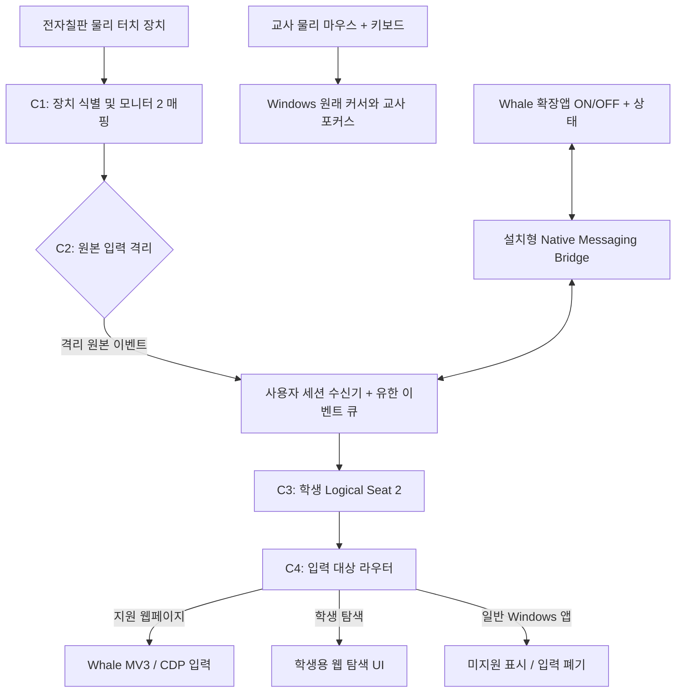

# Whale Dual Input — 웨일 웹 전용 · 모니터 2 독립 터치 개발계획서

> **문서 버전:** 실행계획 v1.0  
> **작성일:** 2026-10-08  
> **기준 설계:** `ARCHITECTURE_V7_3_MONITOR2.md` (v7.3은 기술 아키텍처 원본으로 보존)  
> **프로젝트:** `LUCKYBRIDGE/naver` / Whale Dual Input / NAVER Whale 교육용 확장 프로그램  
> **목적:** 실제 개발을 수행할 수 있는 범위·우선순위·모듈·게이트·완료 기준 제공  
> **상태:** **개발 계획**. 독립 입력 격리 성공, 실제 전자칠판 호환성, 낮은 지연을 이미 증명한 문서가 아님.

---

## 0. 의사결정 요약 — 먼저 읽기

### 0.1 채택하는 단일 제품 방향

**하나의 Windows PC에서 교사의 마우스·키보드는 평소대로 사용하면서, 모니터 2 전자칠판의 물리적 터치만 별도 학생 입력 채널로 격리한다. 학생의 독립 입력을 실제로 전달할 대상은 1차 버전에서 모니터 2에 표시된 Whale 웹 콘텐츠로 제한한다.**

- 교사: **모니터 1의 문서·수업 준비·기타 Windows 업무**를 물리 마우스 1/키보드로 계속 수행한다. **교사 마우스는 모니터 2에도 자유롭게 이동한다.**
- 학생: **모니터 2 전자칠판을 터치**하며, 그 접촉은 **가상 마우스 2/독립 터치 채널**로만 처리한다.
- 프로그램 활성화: 교사가 **웨일 확장앱의 ON/OFF**를 사용한다. 최초 1회 Windows 구성요소 설치가 필요하다.
- 지원 웹 콘텐츠: 웨일스페이스를 포함한 **Whale 브라우저의 일반 HTTP(S) 웹페이지**, Canvas·엔트리형 활동·웹게임을 우선 대상으로 한다.
- **모니터 2 전체 = 입력 격리 범위**, **웨일 웹 콘텐츠 = 입력 전달 범위**. 두 영역은 같을 필요가 없다.
- 모니터 2의 화면 직사각형을 교사가 선택하거나 끌어 설정하는 기능은 **없다**. 표준 Windows 터치 매핑을 자동 인식한다.
- 전자칠판 제조사·VID/PID를 코드에 고정하지 않는다. 표준 장치 경로를 우선 탐지하고 **확실하지 않으면 ON을 거부**한다.

### 0.2 사용자에게 약속할 경험

1. 확장앱에서 **[학생 독립 터치 ON]** 선택.
2. 프로그램이 모니터 2, 터치 장치, 입력 격리 가능 여부를 자동 확인.
3. 격리와 웹 입력 어댑터가 함께 준비된 경우에만 **[독립 터치 활성]** 표시.
4. 학생이 칠판을 터치/드래그/가상 키보드 입력하는 동안 교사 Windows 커서와 업무 포커스가 유지됨.
5. 웨일 외 일반 프로그램을 터치했을 때는 **교사 커서로 우회 전달하지 않음**. 필요한 경우 교사가 **일시 해제**하여 일반 터치를 사용.
6. OFF하면 정상 Windows 터치로 복귀. 오류가 나면 보호 상태와 복구 경로를 명확히 표시.

### 0.3 사용자에게 약속하지 않을 것

| 범위 밖 / 조건부 | 이유와 처리 |
|---|---|
| 모든 Windows 앱(파워포인트, 그림판, 파일 탐색기 등)을 동시에 독립 터치 | 앱별 별도 입력 어댑터가 필요. **1차 미지원** |
| 웨일의 원래 탭바·주소창·브라우저 사이드바를 마우스 2로 직접 클릭 | 일반 CDP 입력은 **웹 콘텐츠** 대상. 학생용 별도 탐색 UI로 대체 |
| 모니터 2의 모든 터치 장치가 100% 자동 지원 | 제조사 전용 입력 경로·마우스 에뮬레이션·매핑 오류가 있을 수 있음 |
| 확장앱만 설치해서 사용 | 원본 Windows 입력 격리에 설치형 구성요소와 권한·서명이 필요할 수 있음 |
| 물리 터치 입력 격리 없이 가상 커서만 표시하여 교사 커서 보호 | **금지**. 표시만으로 G1을 달성하지 못함 |
| 프로세스 종료·보안 데스크톱을 포함한 모든 상황에서 절대적인 무간섭 | Tier A 보호 공백 및 OS 경계 존재. 별도 상태로 표시하고 범위 명시 |

### 0.4 기존 v7.3과의 관계

- 유지: G1 교사 보호 우선, G2 학생 반응 품질, 모니터 2 전체 자동 매핑, Tier A 후보/ Tier B 후순위, C1~C4 계약, `SeatEventV1`, `SAFE_HOLD`/`LOST_PROTECTION`, MouseMux 참조·라이선스 구분, 실기기 검증.
- 좁히는 범위: **최초 출시의 입력 대상은 Whale 웹 콘텐츠 + 별도 학생 탐색 UI**. 전체 Windows 앱 멀티시트 구현을 개발 완료 조건에 넣지 않음.
- 추가: **UIAccess 사용 적합성 게이트**, 브라우저 실제 동작 조기 검증, 교실 UX, 설치 가능성, 명시적 중단 조건.
- 이 문서는 v7.3을 삭제하거나 대체하지 않는 **실행계획**이다. 아키텍처 변경이 필요하면 별도 ADR에 기록한다.

---

## 1. 합격 조건과 중단 조건

### 1.1 절대 합격 조건 G1 — 교사 보호

**실제 전자칠판 입력이 발생하는 동안:**

- 학생 터치로 인해 **교사의 Windows 시스템 커서가 움직이지 않음**.
- 학생 터치로 인해 **교사 업무의 Windows 전경 창·실제 키보드 포커스가 바뀌지 않음**.
- 교사가 모니터 1에서 타이핑하는 글에 학생 입력이 섞이지 않음.
- 교사의 물리 마우스는 모니터 1·2 어디에서도 차단되거나 좌표가 복원·재배치되지 않음.
- `SetCursorPos`로 사후 복원하거나, 전역 `SendInput`으로 학생 입력을 흉내 내어 위 조건을 충족했다고 주장하지 않음.

**판정:** 재현 가능한 시험 중 학생 유래 간섭이 **1건이라도 관측되면 불합격**. 시험 0건은 시험 범위 내 관측 결과이지 모든 장치·장애 상황에 대한 영구 보증이 아니다.

### 1.2 품질 조건 G2 — 학생 사용성

- 일반 웹페이지: 버튼, 링크, 스크롤, 이동, 누름/해제, 드래그.
- Canvas/엔트리·웹게임: 연속 좌표 이동, 누름 유지, 터치와 마우스 합성 입력의 중복 방지.
- 텍스트: HTML 입력란·textarea·contenteditable에서 학생용 가상 키보드, 한글 조합(대상별 호환성 명시).
- 멀티터치: 접촉 ID 유지, `touchStart/Move/End/Cancel` 보존, 페이지마다 호환성 시험.
- 탭 이동/사이트 이동: 수동 좌표 보정 및 매 사이트 재승인 없이 대상 추적. 다만 필요한 확장 권한·브라우저 정책 문제를 숨기지 않음.
- 입력 지연: 격리 수신→어댑터 전달 p50 ≤10ms, p95 ≤25ms는 **최적화 목표**, 터치→실제 렌더링 추가 지연 약 1프레임은 **실측 전 가설**.

### 1.3 출시 차단 조건 (NO-GO)

아래 하나라도 해당하면 해당 구성은 ACTIVE/성공/일반 배포로 표현하지 않는다.

1. **원본 격리를 확보하지 못했거나, 학생 터치가 교사 커서를 움직임.**
2. 허용할 학생 터치 장치가 모니터 2에 안전하게 매핑되지 않음.
3. UIAccess 사용 목적·서명·학교 정책 적합성이 승인되지 않았는데 **Tier A를 배포**하려 함.
4. Tier B가 필요하지만 서명·안전 설치/제거·운영 권한이 확보되지 않음.
5. Native Bridge 또는 Whale CDP 입력 경로가 연결되지 않았는데 ACTIVE를 표시함.
6. 가상 커서 표시만 되고 실제 웹 콘텐츠에 입력이 도달하지 않음.
7. 저수준 마우스 훅의 **좌표만** 기준으로 모니터 2 입력을 모두 차단해 교사 실마우스도 막음.
8. 외부 상용 제품의 공개되지 않은 입력 엔진·드라이버·코드에 무단 의존함.

---

## 2. 기술 구조 — 고정할 시스템 경계



**구현 불변식:** 교사 커서를 건드리지 않는 경로에서 분리한 학생 입력 이벤트만 Whale 웹 콘텐츠에 보낸다. 브라우저 입력 API는 C2 입력 격리를 대신하지 않는다.

### 2.1 실행 구성요소

| 모듈 | 필수 책임 | 금지할 동작 |
|---|---|---|
| `Probe` | 진단: 장치/터치 타입/커서/포커스/호환 마우스 이벤트 | 진단을 보호 성공으로 오인 |
| `DisplayResolver` | 모니터 2 `RECT`, DPI, 터치 장치 매핑, 확장 모드 검사 | 화면 좌표만으로 출처를 판정 |
| `Isolation.A` (후보) | UIAccess 자격 충족 시 PT_TOUCH/PT_PEN 전역 리디렉션 테스트 | PT_MOUSE 장치를 분리한다고 주장 |
| `Isolation.B` (조건부) | 선택 장치의 HID 필터 연구 및 격리 | 모든 HID에 무차별 설치 |
| `StudentInputCore` | 유한 이벤트 큐, contactId/좌표/버튼/epoch 상태 | 이벤트 루프에서 느린 JSON·웹 호출 |
| `Pointer2Renderer` | 모니터 2에 논리 커서 표시(선택) | 교사 OS 커서·hit-test·포커스 조작 |
| `NativeBridge` | Whale 확장과 설치형 프로그램 간 등록·명령/이벤트 전달 | 외부 서버 통신 의존 |
| `WhaleWebAdapter` | 학생 탭 찾기, CDP 연결, 입력·좌표 전달 | OS 전체에 키보드 입력 주입 |
| `StudentNavigationUI` | 주소 입력, 뒤로/앞으로, 새로고침, 탭 변경 | 원래 Whale 브라우저 UI 직접 터치 보장 |
| `Status/Recovery` | OFF/ACTIVE/SAFE_HOLD/LOST_PROTECTION/PAUSED 표시·복구 | 보호가 사라졌는데 ACTIVE 유지 |

### 2.2 데이터 계약 — v7.3 `SeatEventV1` 재사용

```text
SeatEventV1 {
    protocolVersion, sequence, monotonicTimeNs,
    seatId, sourceDeviceId, displayId,
    contactId, sourceKind, phase,
    xPhysicalPx, yPhysicalPx, pressure?, tilt?,
    buttonMask?, wheelDelta?, modifiers?,
    isolationEpoch, geometryEpoch
}
```

- `seatId=student`는 우리 프로그램의 **논리 사용자**, `sourceDeviceId`는 실제 Windows 장치 출처. 혼동하지 않음.
- 접촉은 `(sourceDeviceId, contactId, isolationEpoch)`로 추적.
- 디스플레이 재배치·DPI 변경 시 `geometryEpoch` 증가. 오래된 좌표 재생 금지.
- 탭/네비게이션 변경 시 `navigationEpoch` 증가. 이전 사이트의 눌림 상태·대기 이벤트 정리.
- Native 고빈도 이벤트는 바이너리·유한 길이 큐 우선. 확장 메시징 경계에서만 규격화된 JSON 사용.
- `DOWN/UP/CANCEL` 손실 금지, `MOVE`는 사이트 동작을 고려하여 접촉별 조심스럽게 병합.

### 2.3 좌표 변환 계약

`Windows 물리 화면 좌표 → monitor2 RECT / 화면 회전·DPI → Whale 실제 HWND·콘텐츠 가시 영역 → CDP viewport CSS 좌표`

- 모니터 2가 왼쪽/위쪽에 있어 음수 데스크톱 좌표를 가져도 지원하도록 설계.
- 웨일의 디버거 연결 안내줄, 툴바 높이, 스크롤, 배율 변경은 **연결 후 측정**.
- 브라우저 창이 모니터 2를 벗어나거나 탭 바인딩을 잃으면 **학생 전달만 중단**, 격리 자체는 보호 상태에 따라 유지.
- 페이지별 마우스/터치 모드 선택 시 같은 접촉에 클릭을 두 번 보내지 않음.

---

## 3. 가장 어려운 결정 — Tier A/Tier B

### 3.1 Tier A는 '우선 검증 후보'이지 '즉시 배포 확정'이 아니다

`RegisterPointerInputTarget`을 **서명된 UIAccess 앱**의 창에서 호출하여 `PT_TOUCH` 또는 `PT_PEN` 유형 전체를 가로채는 경로.

**공식 사실**

- 지정 포인터 타입 전체를 한 데스크톱에서 단일 등록 창으로 리디렉션하는 API. **모니터 2만, 장치 1개만 선택하는 API가 아님**.
- `PT_MOUSE` 및 `PT_POINTER`를 등록할 수 없음.
- 등록 창이 해제되거나 파괴되면 등록 보호 소멸. watchdog은 이후 복구할 뿐 무간섭 공백을 없애지 못함.
- `WS_EX_NOACTIVATE` 또는 message-only 창을 사용해 등록 창의 포커스 획득 위험을 줄이되 **실측이 필요**.
- **UIAccess는 Microsoft가 접근성 보조 기술용으로 안내하며 비보조 기술의 UIAccess 사용을 권장하지 않음**. 우리 교육용 프로그램이 그 사용 목적에 부합하는지는 기술 가능성과 **별도** 판단해야 함.

**M0.4 배포 적합성 판정의 두 축**

1. 기술: 앱 서명, 보호된 위치 설치, 사용자 데스크톱 실행, 포인터 등록 성공, 이벤트 격리 가능.
2. 정책·목적: 접근성 시나리오 해당 여부, Windows 가이드 준수, 공모전·학교 배포 정책 충족. 목적 부합성이 불명확하면 Tier A는 **연구/시험 전용**이고 배포 경로로 확정하지 않음.

**Tier A v1 제약**

- 교사 PC가 별도의 터치스크린도 갖고 있다면 타입 전역 가로채기가 이를 함께 차단할 수 있음. 기본 `UNSUPPORTED`; 별도 지원 설계 없이 조용히 강행하지 않음.
- 전자칠판이 HID 마우스 에뮬레이션만 제공하면 Tier A 경로로는 격리 불가.
- 잠금/UAC 등 다른 데스크톱 전환·프로세스 강제 종료 시 보호 연속성 보장 불가.

### 3.2 Tier B는 배포 여건 통과 후에만 착수

- KMDF/HID **장치별 필터**를 조사하고, 먼저 관찰 전용 필터 → 대상 장치 선택 격리 → 이벤트 전달 순서로 진행.
- 드라이버 서명, 관리자 설치 권한, Secure Boot/HVCI 호환성, 오설치 시 롤백, 학교 관리 정책은 별도 합격 조건.
- 타사 상용 제품의 드라이버·엔진·SDK는 포함하지 않음.
- **Tier B를 실행할 수 없고 Tier A도 부적합하면, 원본 분리 목표를 달성했다고 발표하거나 사후 커서 복원으로 대체하지 않음.** `NO-GO`로 판단하고 범위/배포 전략 재검토.

### 3.3 프로그램 보호 상태

```text
OFF -> DISCOVERING -> PREPARING -> ACTIVE
                     -> UNSUPPORTED
ACTIVE -> SAFE_HOLD         (원본 격리는 여전히 살아 있음)
ACTIVE -> LOST_PROTECTION   (등록/필터 보호 자체가 사라짐)
ACTIVE -> PAUSED_BY_TEACHER -> ACTIVE 또는 OFF
SAFE_HOLD -> ACTIVE / LOST_PROTECTION / OFF
LOST_PROTECTION -> PREPARING / OFF
```

- **ACTIVE**: 격리 활성 ACK + 격리 수신 상태 + 학생 채널 + Whale 어댑터 준비 확인.
- **SAFE_HOLD**: 격리는 유지하지만 입력 전달 연결 장애. 학생 화면은 일시 정지; 눌림 상태 취소.
- **LOST_PROTECTION**: Tier A 창 파괴 등으로 원본 입력 보호가 없어진 상태. 교사에게 경고. 절대 ACTIVE로 표시하지 않음.
- **PAUSED_BY_TEACHER**: 교사가 의도적으로 Windows 일반 터치로 복귀. 이 상태에서 학생 보호는 활성 상태가 아님.
- **기본 부팅은 OFF**. UI 표시가 죽어도 교사가 **물리 마우스/키보드**로 복구할 수 있어야 함.

---

## 4. 개발 단계별 실행 계획

> 단계 번호는 기존 v7.3을 유지한다. **진단 도구·브라우저 최소 실험 코드는 먼저 만들 수 있지만**, 교사 입력 보호가 검증되기 전에 제품을 독립 터치 성공으로 표시하지 않는다.

### M0. 제품 범위 확정 및 기준선 보존

**개발 작업**

- v7.3 아키텍처와 본 계획을 우선 문서로 연결.
- 기존 v0.2.0 Native Host/CDP/한글 가상 키보드 코드의 재사용 가능 요소만 목록화.
- 학생 모니터 2 전체 입력 격리 + Whale 웹 콘텐츠 입력 전달이라는 범위 고정.
- 코드 교체 전 브랜치 또는 작업 트리로 기존 실행 버전 보존. 자동 삭제·대규모 전면 재작성 금지.

**산출물:** `IMPLEMENTATION_SCOPE.md`, `CODE_REUSE_AUDIT.md`.  
**통과:** 지원/미지원, G1/G2, 원본 보존 원칙을 개발자와 테스트 담당자가 동일하게 이해.

### M0.4. 기술·배포 적합성 사전 판정 — 필수 첫 번째 게이트

**개발 작업**

- 대상 Windows PC의 관리자 설치 권한, 코드 서명, 설치 위치, 학교 보안 정책 점검.
- **UIAccess의 접근성 보조 기술용 사용 정책에 우리 제품이 적합한지** 조사·기록. 기술적으로 동작한다는 이유만으로 배포 가능 처리 금지.
- Tier B 대비 드라이버 서명·HVCI·운영 부담의 현실성 판단.
- Whale 설치형 브리지와 확장 프로그램의 허용 ID·Native Messaging 배포 경로 검토.

**산출물:** `INSTALLATION_FEASIBILITY.md`, `UIACCESS_POLICY_DECISION.md`.  
**통과:** Tier A를 **제품 후보 / 연구 전용 / 배제** 중 어디에 둘지 기록. Tier B 진행 가능 여부도 조건부 판단.

### M0.5. 장치 경로·교사 커서 납치 현상 진단 — 가장 중요한 선행 작업

**개발 작업**

- `Probe` 제작: `GetPointerDevices`, `GetPointerDeviceRects`, Raw Input, HID/장치 인스턴스, `WM_POINTER`, `sourceDevice` 조사.
- Windows 확장 모드/모니터 2 `RECT`, 디스플레이 DPI·회전·좌표, 터치 디지타이저 매핑 조회.
- 칠판 터치가 `PT_TOUCH`, `PT_PEN`, `PT_MOUSE` 또는 별도 HID 마우스인지 식별.
- 격리 OFF 기준선: `GetCursorPos` 고빈도 샘플링 + 교사 마우스 Raw Input + `EVENT_SYSTEM_FOREGROUND`/`EVENT_OBJECT_FOCUS` + `GetGUIThreadInfo`로 변화 기록.
- 터치 유래 호환 마우스 이벤트가 보이는지 조사. 포인터/마우스 합성 이벤트 중복 여부 확인.
- 동일 PC에 터치 장치가 둘 이상인지 확인. 잠금/UAC·USB 재연결 영향 관찰(시험 PC에서만).
- 로거가 격리 OFF 시 **실제 간섭을 잡아내는 양성 대조군** 확보.

**산출물:** `M0_5_MEASUREMENT.md`, `probe/` 코드, 익명화된 샘플 로그.  
**통과:** 실제 연결 기기의 입력 경로를 분류하고, 교사 간섭을 계측할 수 있음을 재현.

### M1. 모니터 2와 터치 장치 자동 연결

**개발 작업**

- `QueryDisplayConfig`와 `GetMonitorInfo`로 확장 모드의 모니터 2 탐색.
- 터치/펜 장치에 매핑된 화면 식별. 디스플레이 경로 ID와 연결 재검증.
- 모호함·복제 모드·잘못된 매핑·다른 터치 장치 공존 시 안전하게 실패.
- 화면 좌우 위치 변경·해상도·배율·회전 재계산. 교사에게 수동 사각형 선택을 요구하지 않음.

**산출물:** `DisplayResolver`, `INPUT_SUPPORT_MATRIX.md`.  
**통과:** 표준 매핑 구성의 모니터 2·전자칠판을 자동 식별하고 모호한 장치를 임의로 선택하지 않음.

### M2a. 원본 터치 격리 PoC — G1 결정 게이트

**개발 작업**

- M0.4를 통과한 경로에서 최소 격리 구현. **처음에는 터치만 삼키고 학생 앱에 전달하지 않음.**
- Tier A가 합법·정책상 제품 후보이면 UIAccess 창+전용 메시지 스레드로 `PT_TOUCH` 우선 시험. 정책상 연구 전용이면 연구 환경 한정.
- 학생 터치 중 교사 커서/실제 포커스/타이핑 유지, 마우스 1의 모니터 2 클릭 정상 여부 측정.
- 터치발 WM_MOUSE/기타 호환 이벤트가 새는지 측정.
- 다른 터치 장치 공존, 등록 충돌, 창 파괴/감시 복구 공백을 별도 계측.
- 실패하면 **원인(타입/자격/실제 커서 간섭/설치 정책)을 분리**하고 Tier B 진입 여부 판정.

**산출물:** `M2A_G1_REPORT.md`, 격리 PoC 코드, 테스트 로그·영상.  
**통과:** 실제 칠판 + 교사 실마우스로 정상 동작 조건에서 **학생 유래 커서·포커스 간섭 0건**, 교사 마우스 정상. Tier A 장애 공백은 별도 위험으로 기록하고 숨기지 않음.

**중단 규칙:** C2가 동작하지 않으면 임의 오버레이, 커서 복원, `WH_MOUSE_LL` 좌표 차단으로 넘어가지 말고 Tier B 게이트 또는 NO-GO.

### M2b. 입력 격리와 학생 채널 연결

**개발 작업**

- 격리 프로세스가 받은 데이터를 `SeatEventV1`로 변환해 유한 길이 큐에 기록.
- 높은 빈도의 이동과 터치/버튼 상태를 분리 관리. 재연결 때 `isolationEpoch` 변경.
- watchdog, `SAFE_HOLD`, `LOST_PROTECTION`, 긴급 일시 해제, 접촉 취소, 교사 단축키 마련.
- 메시지 프로세스는 포인터 수신·큐 기록·하트비트만 수행하고 네트워크/로그/브라우저 호출 금지.

**산출물:** `StudentInputCore`, `ProtectionStateMachine`, `M2B_CHANNEL_REPORT.md`.  
**통과:** 교사 G1 유지 + 학생 이벤트 순서·접촉 ID·해제 정보 전달, 서비스 장애 복구 가능.

### M3. 논리 마우스 2와 좌표 엔진

**개발 작업**

- 모니터 2 화면 안에만 존재하는 **논리적 가상 커서**. 실제 Windows 시스템 커서를 건드리지 않음.
- `DOWN/MOVE/UP/CANCEL`, 접촉 ID별 상태, 두 손가락 이상의 좌표 스트림 유지.
- 페이지용 터치/마우스 정책을 분리하고 중복 클릭 방지.
- 교사 마우스 클릭과 학생 터치가 동시에 발생할 때 상태 충돌 감시.

**산출물:** `Pointer2`, `SeatEventV1` 검증 시험.  
**통과:** 교사 시스템 커서와 독립된 좌표·누름/해제 상태가 실시간으로 관리됨.

### M4a. Whale 연결 가능성 조기 확인 및 어댑터 최소 구현

**개발 작업**

- 먼저 **가상/합성 학생 이벤트를 사용해** 실제 Whale에서 MV3 `chrome.debugger` 연결, CDP `Input.dispatchMouseEvent`, `Input.dispatchTouchEvent`, `Input.insertText`, 포커스 에뮬레이션 후보를 검증.
- 이 실험은 G1 완료와 별개로 **브라우저 기술 검증용**으로 선행 가능. 실제 독립 터치 성공으로 표시하지 않음.
- Whale 보안 정책·디버거 연결 안내줄·MV3 Worker 중단/재연결·탭 식별 등 차이를 확인.
- 모니터 2 내 학생용 Whale 창, 탭·탐색 epoch, DPI/viewport 변환 확인.

**산출물:** `WHALE_COMPATIBILITY_PROBE.md`, `WhaleWebAdapter` 최소 시험 코드.  
**통과:** Whale 웹 콘텐츠에 **Windows 커서를 움직이지 않고** 합성 입력을 전달할 수 있음을 실제 실행으로 확인. 미지원 명령·페이지 제한 별도 기록.

### M4b. 물리 터치→Whale 통합 및 학생 탐색 UI

**개발 작업**

- 실제 `StudentInputCore` 이벤트를 Native Bridge→Whale Extension→CDP 연결.
- 모니터 2 창 자동 선택, 페이지 이동/탭 전환 후 세션 재결합, 연결 과정의 resize 자동 보정.
- 교사 Windows 포커스를 유지하면서 링크·Canvas·웹게임·한글 입력·터치 제스처 시험.
- 학생용 주소창/뒤로/앞으로/홈/새로고침/탭 UI 구현(실제 Whale 원래 브라우저 UI 직접 터치는 약속하지 않음).
- 일반 Windows 앱/보안 페이지 터치 시 OS 입력으로 재주입하지 않고 미지원 상태 표시.

**산출물:** `WhaleWebAdapter`, `StudentNavigationUI`, `WHALE_INPUT_TEST_REPORT.md`.  
**통과:** 학생이 모니터 2 Whale 웹페이지에서 활동하는 동안 교사는 모니터 1의 다른 앱에 연속 타이핑할 수 있음.

### M5. 설치형 제품·회복성·출품 준비

**개발 작업**

- 설치/제거: Windows 구성요소(필요 시 서명된 필터), Native Messaging Manifest, Whale 확장 ID, 권한 안내.
- 확장앱 ON/OFF와 트레이 복구 수단. 프로그램 종료·절전·USB 재연결·잠금 후 상태 관리.
- 교사 사용 설명서: 사전 요구사항, 지원/미지원, 실제 ON 상태, `PAUSED`/`LOST_PROTECTION` 의미.
- 로그 개인정보 최소화, 인터넷 없는 로컬 동작, 학교 관리자 설치 정책 검증.
- 공모전 요건과 **Native 앱 설치 필요성**, 확장앱의 독자 기여(상태·브라우저 입력 어댑터·탐색 UI)를 제출 전 확인.

**산출물:** 설치 패키지, MV3 확장앱, 시연 가이드, `V7_ACCEPTANCE_TEST.md`, `RELEASE_NOTES.md`.  
**통과:** 지원 장치에서 교사 설정은 사실상 ON/OFF 중심, 수동 영역 지정·커서 복원 없음. 실패를 감추지 않고 복구 가능.

---

## 5. 단계별 산출물 체크리스트

| 단계 | 구현 산출물 | 강제 의사결정 |
|---|---|---|
| M0 | 범위·소스 재사용 점검 | Windows 앱 전체 지원을 1차에서 제외 |
| M0.4 | 서명/권한/UIAccess 사용 적합성 문서 | Tier A 제품 후보 / 연구 전용 / 배제 |
| M0.5 | 장치 진단 + 커서/포커스 양성 대조군 | PT_TOUCH/PT_PEN/PT_MOUSE 식별 |
| M1 | 모니터 2 자동 디스플레이 매핑 | 확장 모드·매핑 불명확 시 ON 금지 |
| M2a | 터치 차단만 하는 격리 PoC | G1 통과 실패 시 Tier B 게이트/NO-GO |
| M2b | 이벤트 큐 + 상태/복구 | SAFE_HOLD/LOST_PROTECTION 실제 구분 |
| M3 | 독립 논리 커서·멀티터치 | 접촉·버튼 상태 일치성 |
| M4a | Whale CDP 실제 호환성 실험 | 브라우저 정책/포커스 제약 확인 |
| M4b | 물리 터치→Whale 통합·학생 탐색 UI | G1+G2 동시 실기기 통과 |
| M5 | 설치/제거·복구·보안·공모전 시연 | 지원 기기만 배포 후보 |

**운영 원칙:** 브라우저 M4a 최소 실험은 M0.5와 병행 가능하되 G1을 대체하지 않는다. 개발 용이성을 높이기 위해 실제 입력 격리 실패를 숨긴 채 UI만 완성하지 않는다.

---

## 6. 검증 시나리오 — 최종 완료 판정

### 6.1 G1: 교사 보호(필수)

| 시험 ID | 동작 | 합격 조건 |
|---|---|---|
| G1-01 | 교사가 Word/한글/메모장에 입력 중, 칠판에서 100회 터치 | 학생 유래 Windows 커서 변화·전경/내부 포커스 변화·타이핑 혼입 **0건** |
| G1-02 | 칠판에서 30초 이상 연속 드래그 | 교사 타이핑 유지, 터치 해제 누락 없음 |
| G1-03 | 교사 마우스가 모니터 2로 이동·클릭 | 마우스 1 정상 동작, 좌표 기반 차단 없음 |
| G1-04 | 교사 클릭 + 학생 터치 동시 수행 | 물리 마우스·학생 이벤트 식별, 교사 포커스 유지 |
| G1-05 | 디스플레이·USB 연결 변화 | 매핑 확인 전 자동 ACTIVE 금지 |
| G1-06 | Native Bridge 중단 | 격리 생존 시만 SAFE_HOLD. 복구 수단 유효 |
| G1-07 | Tier A 등록 창 강제 종료 | **LOST_PROTECTION**, 보호 공백 시간·실제 간섭 측정, 무간섭 허위 주장 금지 |
| G1-08 | 잠금 화면/UAC/보안 데스크톱 | 보호 범위를 벗어나는지 측정, 미지원/위험 안내 |
| G1-09 | 호환 마우스 이벤트·창 내부 포커스 | 학생 유래 커서/포커스 부작용 탐지 |
| G1-10 | 교사 터치 노트북 공존/등록 충돌 | 지원 불가 조건을 ON 전에 정확히 탐지 |

### 6.2 G2: 웹 입력 품질(필수)

| 시험 ID | 학생 동작 | 검증 대상 |
|---|---|---|
| G2-01 | 일반 사이트 링크 클릭·스크롤 | 실제 페이지 클릭 위치/반응 |
| G2-02 | 엔트리·Canvas 게임 조작 | 누른 채 이동, 프레임 유실, 버튼 고착 |
| G2-03 | 두 손가락 제스처 | 접촉 ID·취소·페이지별 호환성 |
| G2-04 | 한글 문장 입력/조합/백스페이스 | 학생 입력란만 변화, 교사 IME 무영향 |
| G2-05 | 탭 전환·새 페이지·팝업 | 입력 대상·좌표 정확성, 이전 큐 재생 금지 |
| G2-06 | 웨일 디버거 배너로 viewport 변경 | 자동 재측정, 불필요한 OFF 없음 |
| G2-07 | 학생 웹페이지가 OS 전경이 아닐 때 | 가능한 범위의 CDP 입력 및 포커스 에뮬레이션 실제 검증 |
| G2-08 | 확장앱 Worker 재시작/브리지 재연결 | ACTIVE 상태 정직성, 키·버튼·접촉 상태 정리 |
| G2-09 | 일반 Windows 앱 터치 | 교사 Windows 커서로 우회하지 않음, 명확한 미지원 안내 |
| G2-10 | 다른 DPI·배율·모니터 2 위치 | 터치 위치 오차, 이벤트 end-to-end 지연 측정 |

### 6.3 성능 측정 방법

- **격리 수신 → 브라우저 어댑터로 전송:** 이벤트 시각과 순서 ID로 p50/p95/p99 계산.
- **물리 터치 → 웹 콘텐츠 렌더링:** Windows 직접 터치와 동일 기기 조건에서 비교. 가능하면 영상/ETW·도구 계측으로 보강.
- 로그가 입력 지연을 유발할 수 있으므로 **정확성 시험**과 **성능 시험**은 별도 실행.
- 10ms, 25ms, 1프레임은 **목표값이지 현재 실측값이 아님**.
- 사이트 종류·CPU 부하·멀티터치 수에 따라 지연 분포를 분리한다.

---

## 7. 실제 교실 사용 UX

### 7.1 교사가 보는 최소 인터페이스

```text
[웨일 듀얼 인풋]

연결:   모니터 2 / 전자칠판 터치 인식
보호:   OFF / 준비 중 / ACTIVE / 잠시 중지 / 보호 상실 / 미지원
학생 웹: 웨일 창 연결 / 재연결 중 / 미지원

[학생 독립 터치 ON]  [OFF]
[교사 일시 해제]      [진단 보기]
```

- 기본 화면에는 개발용 VID/PID나 좌표 조정값을 노출하지 않음.
- **교사 일시 해제**는 터치가 다시 기존 Windows 입력으로 작동함을 명확히 안내.
- 재연결 중 학생은 반응이 잠깐 없을 수 있지만 교사의 Windows 입력을 대신 움직이지 않음.
- 외부 앱 미지원 경고는 페이지 위 콘텐츠를 가리지 않는 방식으로 제공하고, 경고 자체가 포커스를 가져가지 않음.

### 7.2 학생이 보는 화면

- 웨일 웹페이지 중심으로 표시하고, 필요 시 **학생 전용 주소/탭 이동 툴바**를 별도로 제공.
- 가상 마우스 2 표시 여부는 터치 특성에 따라 선택(손가락 터치는 표시 최소화 가능).
- 학생 가상 키보드는 **웹페이지 입력란만** 수정하도록 설계; Windows 기본 OSK를 사용하지 않음.
- 브라우저가 아닌 앱을 터치하면 **동작하지 않는 이유**를 알리되 시스템 클릭을 발생시키지 않음.

---

## 8. 보안·라이선스·운영

- 웨일 확장앱: `nativeMessaging`, `debugger`, 탭 탐색에 필요한 권한만 사용. 디버거는 높은 권한·조직 정책 제약이 있으므로 안내와 실패 처리를 구현.
- Native Messaging 호스트: 확장 ID를 정확하게 허용하고 로컬 프로세스 간 채널에는 ACL·인증을 적용.
- 외부 서버로 터치 원본, 학생 키 입력, 페이지 내용을 전송하지 않음.
- 로그: 장치 형식, 오류 코드, 보호 상태, 이벤트 **개수·시간·지연**만 최소 수집. URL·문서 제목·입력 문장은 기본 로그에서 제외.
- MouseMux `WinSDK---Native-Windows-SDK`: MIT로 공개된 V2 예제. 필요하면 라이선스 고지를 포함해 재사용할 수 있으나 **본 계획에서는 원본 코드 없이 설계 참고만**.
- MouseMux `Chrome`: 별도 라이선스 확인 없이 코드·패치 재사용 금지. 수정 Chromium의 내부 입력 주입을 일반 Whale 확장앱에서 사용할 수 있다고 가정하지 않음.
- `RESEARCH_REFERENCES.md`(참고 자료)와 `THIRD_PARTY_NOTICES.md`(실제 포함 코드)를 분리.
- 공모전 시연 성공과 학교 배포 성공을 구분. 배포는 설치 권한·서명·장치 호환성·사용자 안내까지 충족해야 함.

---

## 9. GitHub 구현 폴더와 기록 파일

> 기존 파일을 그대로 옮겨야 한다는 명령이 아니다. 실제 파일 구조를 확인하고 충돌하지 않도록 이관·연결한다.

```text
projects/whale-dual-input/
├── 01_기획_및_지침/docs/
│   ├── ARCHITECTURE_V7_3_MONITOR2.md     # 기술 기준 원본
│   ├── DEVELOPMENT_PLAN_V1_WHALE_MONITOR2.md   # 이 개발계획
│   ├── IMPLEMENTATION_SCOPE.md
│   ├── CODE_REUSE_AUDIT.md
│   ├── INSTALLATION_FEASIBILITY.md
│   ├── UIACCESS_POLICY_DECISION.md
│   ├── M0_5_MEASUREMENT.md
│   ├── M2A_G1_REPORT.md
│   ├── M2B_CHANNEL_REPORT.md
│   ├── WHALE_COMPATIBILITY_PROBE.md
│   ├── WHALE_INPUT_TEST_REPORT.md
│   ├── INPUT_SUPPORT_MATRIX.md
│   ├── V7_ACCEPTANCE_TEST.md
│   ├── RESEARCH_REFERENCES.md
│   └── THIRD_PARTY_NOTICES.md
├── 02_제작_결과물/
│   ├── manifest.json
│   ├── background/                      # MV3 Worker / CDP
│   ├── content/                         # 학생 UI·한글 입력
│   └── native/                          # 기존 코드 보존/이관 관리
└── windows/
    ├── WhaleDualInput.Probe/
    ├── WhaleDualInput.Display/
    ├── WhaleDualInput.Isolation.A/       # 적합성 통과 시
    ├── WhaleDualInput.StudentInputCore/
    ├── WhaleDualInput.NativeBridge/
    ├── WhaleDualInput.Pointer2/
    ├── WhaleDualInput.Installer/
    └── driver/                           # Tier B 게이트 통과 시만
```

### 구현 작업 진행 규칙

1. `AGENTS.md`와 `HANDOFF.md`에 최상위 G1·지원 범위를 반영하되, 다른 프로젝트 지침은 덮어쓰지 않음.
2. 개발 단계별 커밋/브랜치에는 **현재 무엇을 검증했고 무엇은 가설인지** 남김.
3. 기존 Native Host·CDP·한글 입력 소스는 무조건 삭제하지 않고 실제 회귀 시험을 거쳐 재사용 여부 결정.
4. 실제 Windows 하드웨어 시험을 수행하지 않은 상태에서는 `G1 PASS`, `DEVICE SUPPORTED`, `READY TO SHIP`을 선언하지 않음.
5. Tier A/B 선택과 배포 정책의 변경은 아키텍처 ADR 개정으로 기록하고, UI 편의를 위해 입력 보호를 약화시키지 않음.

---

## 10. 개발 담당자/AI 코딩 도구에 전달할 실행 프롬프트

> `LUCKYBRIDGE/naver`의 실제 소스 및 `AGENTS.md`, `HANDOFF.md`를 먼저 검토하라. `ARCHITECTURE_V7_3_MONITOR2.md`를 기술 기준으로, `DEVELOPMENT_PLAN_V1_WHALE_MONITOR2.md`를 최신 실행 계획으로 취급하라. 단일 Windows PC의 확장 모드에서 **모니터 2 전자칠판 물리 터치 전체**를 교사의 Windows 커서/키보드 포커스에서 격리하되, 학생 입력을 실제 전달할 대상은 **모니터 2의 Whale 웹 콘텐츠와 별도 학생 탐색 UI**로 제한하라. 교사 물리 마우스는 모니터 1·2 어디서나 정상 작동해야 하며, 커서를 이동시킨 뒤 되돌리는 방식은 금지한다. 제조사별 장치 ID 하드코딩·수동 화면 사각형 선택은 도입하지 않는다.
>
> 먼저 M0·M0.4에서 기존 코드를 보존하고, UIAccess 기술적 조건뿐 아니라 **접근성 보조 기술용 사용 정책에 우리 제품이 적합한지** 검토하라. M0.5의 실제 장치 판정 로거와 양성 대조군을 구현하고 M1에서 안전하게 모니터 2 장치를 자동 매핑하라. M2a는 원본 터치 **격리만** 구현해 교사 커서·실제 포커스·타이핑 무간섭을 시험하라. Tier A가 부적합하거나 실패하면 무리한 사후 보정 없이 Tier B 배포 게이트/NO-GO를 검토하라. Tier A watchdog이 보호 공백을 제거하지 못함을 명시하라.
>
> G1이 입증된 뒤 M2b·M3에서 `SeatEventV1`과 논리 마우스 2·멀티터치를 연결하라. 별도로 M4a는 **가상 합성 이벤트만으로** 실제 Whale `chrome.debugger`/CDP/Native Messaging/포커스·좌표 변환을 조기 검증할 수 있으나 G1 성공으로 표시하지 않는다. M4b에서 실제 전자칠판 이벤트와 Whale 웹 콘텐츠를 통합하며, 탭/주소창 등 브라우저 원래 UI 직접 조작은 약속하지 말고 별도 학생 탐색 UI를 제공하라. 마지막 M5에서 설치/제거·학교 정책·성능·교사 복구를 확인하라. `SAFE_HOLD`와 `LOST_PROTECTION`을 구별하고, 외부 상용 다중 입력 엔진이나 라이선스 미확인 Chrome 패치 코드는 사용하지 않는다. 실제 기기 시험이 없으면 성공으로 보고하지 마라.

---

## 11. 공식 근거·추가 검증 자료

**v7.3에서 가져온 것:** G1/G2와 C1~C4 경계, M0.4→M5 단계, `SeatEventV1`, 장치별 지원 한계, MouseMux 자료 취급, 장애 상태 구분. 자세한 근거 수준은 `ARCHITECTURE_V7_3_MONITOR2.md` 부록 C 참고.

**이번 실행계획에서 추가 명시한 외부 공식 근거:**

1. Microsoft, [RegisterPointerInputTarget](https://learn.microsoft.com/en-us/windows/win32/api/winuser/nf-winuser-registerpointerinputtarget) — 포인터 유형별 전역 리디렉션, UIAccess 자격, `PT_MOUSE` 불가, 등록 창 소멸 시 해제.
2. Microsoft, [Security Considerations for Assistive Technologies](https://learn.microsoft.com/en-us/windows/win32/winauto/uiauto-securityoverview) — UIAccess의 접근성 용도, 서명·신뢰 위치·manifest, 비접근성 앱 사용 관련 주의.
3. Chrome Developers, [debugger API](https://developer.chrome.com/docs/extensions/reference/api/debugger) — 확장앱 CDP 세션·Input 도메인 접근, 조직 정책 제약.
4. Chrome Developers, [Native Messaging](https://developer.chrome.com/docs/extensions/develop/concepts/native-messaging) — 설치형 Native Host와 확장앱 통신.
5. Chrome DevTools Protocol, [Input](https://chromedevtools.github.io/devtools-protocol/tot/Input/) — 콘텐츠 입력 이벤트 전달. Whale 제품별 실제 작동은 별도 시험.
6. MouseMux, [V2 WinSDK MIT 예제](https://github.com/MouseMux/WinSDK---Native-Windows-SDK), [Chrome 통합 공개 저장소](https://github.com/MouseMux/Chrome) — 서로 라이선스·기술 범위가 다른 참고 자료. 본 프로젝트는 자체 구현.

---

## 최종 결론

**제품의 실제 격리 범위는 모니터 2 전체, 조작 지원 범위는 Whale 웹 콘텐츠로 제한한다.** 그래서 전자칠판 터치 분리의 핵심 목표를 훼손하지 않으면서도 전체 Windows 앱용 두 번째 마우스·포커스 엔진을 개발할 부담을 피한다. 첫 개발 작업은 화려한 가상 커서나 탐색 UI가 아니라 **실기기 장치 진단(M0.5), UIAccess 정책 적합성(M0.4), 격리 증명(M2a)** 이다.

**아직 해결되지 않은 가장 큰 문제:** 지원 전자칠판에서 교사 Windows 커서·키보드 포커스가 절대로 이동하지 않도록 **원본 터치를 실제로 격리할 수 있는지**. 이 문제의 검증에 실패하면 계획상의 완료 판정을 내리지 않는다.
